# MULTI_AGENT_PLATFORM_SPEC_V1.md

**Multi-Agent AI Platform / Agent Control Plane**
**Product & Technical Specification — Version 1.1 (Spec Freeze Correction Pass)**

| | |
|---|---|
| Status | DRAFT — CORRECTION PASS APPLIED, PENDING OWNER SIGN-OFF (see Section 35a for blockers) |
| Author | Principal Product Architect / Principal AI Systems Architect (Claude) |
| Owner | Serge Tchuenteu |
| Date | 2026-09-16 |
| Scope | Product vision, architecture, data model, API contracts, state machines, V1 scope, phased roadmap |
| Explicit non-scope | No code, no repository, no implementation, no migrations, no database creation in this document or this pass |

> **Revision note (v1.0 → v1.1, this pass).** This revision is a **specification correction pass only** — no application code, repository, migrations, or infrastructure was created. Two things changed: (1) an explicit Owner Decision freezing **SQLite as the V1 database** (local-first deployment), replacing every prior PostgreSQL reference; (2) resolution of 20 pre-implementation review gaps in the data model, state machines, and API contracts identified before MA0 could begin. All existing architectural boundaries (Agent≠Model, Agent/Prompt/Workflow versioning, Tool Bus, Sandbox isolation, Flight Recorder, Cost/Budget Governor, Approval Service, Comparison Runs, objective-first Evaluation, bounded repair loops, Workflow/DAG engine, Mode 3 hard isolation, manual-before-autonomous) are preserved unchanged in substance; only their persistence representation and a handful of previously-implicit contracts were made explicit. A full change log is in the new **Section 0a** below; the corrected database decision is frozen in the new **Section 10.5**; new/changed data-model entities are in the new **Section 24.4**; state-machine corrections are in the new **Section 26.7**; API contract changes are in the new **Section 25.5**; remaining Owner Decisions are in the revised **Appendix D**; new risks are in the new **Section 33.1**; and the final readiness verdict is in the new **Section 35a**.

> **Note on reference material.** This spec was requested alongside a reference tool, `openrouter-free-models_v3.html`, described as a browser-based OpenRouter model catalog utility (model discovery, provider listing, model IDs, pricing, context length, modality metadata, architecture metadata, throughput, pricing inspection, and catalog export). That file was not accessible in this session (not attached, and no local folder was connected at time of writing). Nothing in this spec depends on its literal contents — the brief already enumerates the concepts to preserve, and Section 13 (Model/Provider Architecture) is designed to absorb and generalize them. If the actual file surfaces useful field-level detail (exact OpenRouter JSON shape, specific UI affordances worth keeping), that should be a fast amendment to Section 13/24, not a rework of the architecture. This is flagged again in Section 35 as an open item.

---

## 0a. Change Log — v1.0 → v1.1 (This Pass)

**Owner-directed change (explicit instruction, not a Claude judgment call):**

- **Database.** V1 primary database changed from **PostgreSQL** to **SQLite**, deployment model **local-first**. Backend frozen to **Python + FastAPI**, ORM **SQLAlchemy**, migrations **Alembic**, DB file at `data/multi_agent_platform.db`. PostgreSQL is explicitly **not** a V1 dependency; portability to a future hosted/multi-user Postgres deployment is preserved by construction (Section 10.5).

**Gap-resolution changes (pre-implementation review, resolved per Owner instruction to close them before MA0):**

1. Explicit `workflow_runs` entity added (Section 24.4).
2. Explicit `workflow_node_runs` entity added (Section 24.4).
3. Explicit `prompt_versions` entity added, decoupled from `agent_versions.system_instructions_ref` (Section 24.4).
4. Explicit `execution_events` entity added as the Flight Recorder's storage, formally separated from security `audit_events` (Section 24.4).
5. Explicit `tools` entity (stable tool IDs) added; `agent_versions` tool grants normalized into `agent_version_tool_grants` join table (Section 24.4).
6. Explicit `project_memberships` entity added for project-level RBAC (Section 24.4).
7. `comparison_runs.candidate_agent_run_ids[]` array replaced with normalized `comparison_candidates` join table (Section 24.4).
8. Explicit `provider_model_snapshots` entity added so historical Agent Runs bind to an immutable snapshot of model/provider metadata, not the live (mutable) registry row (Section 24.4).
9. Explicit `task_run_config_snapshot` (embedded JSON snapshot column, Section 24.4) capturing the Task's exact configuration at run start.
10. Explicit `agent_run_attempts` entity added for durable retry/attempt history (Section 24.4).
11. Explicit `idempotency_keys` entity added for durable side-effect idempotency, generalizing Section 28.3 (Section 24.4).
12. Explicit lease/heartbeat/fencing columns added to `agent_runs`, `workflow_node_runs`, and the new `job_queue` entity, for worker-crash recovery (Section 24.4, 26.7).
13. Explicit `budget_reservations` entity added so concurrent/parallel execution (Mode 3) reserves budget before spending rather than only recording usage after the fact (Section 24.4).
14. Explicit `router_policy_versions` and `model_routing_decisions` entities added so auto-routing decisions bind to a versioned, snapshotted policy (Section 24.4).
15. Explicit `action_fingerprint` / `bound_artifact_id` binding added to `approvals`, so an approval applies only to the exact artifact/action shown to the approver, re-verified at execution time (Section 24.4).
16. Explicit cancellation-propagation rule and `cancellation_requested_at/by` columns added at Task Run / Workflow Run / Agent Run levels, plus a `CANCELLING` intermediate state (Section 26.7).
17. Explicit `source_snapshots` entity added (repo URL, base ref, base commit SHA) for coding-task reproducibility (Section 24.4).
18. Explicit `content_hash`, `size_bytes`, `mime_type` columns added to `artifacts` (Section 24.4).
19. Explicit `secret_references` entity added; provider/integration secrets are referenced by opaque pointer, never stored by value in ordinary domain tables (Section 24.4) — see also new Owner Decision on local secret storage (Appendix D).
20. Task vs. Task Run status-enum overlap resolved (Task simplified to a template/lifecycle-only status; all execution state lives on Task Run) and Agent Version `deprecated` vs. `retired` behavior disambiguated (Section 26.7).

No item above required removing, weakening, or renaming any of the architectural boundaries this pass was told to preserve (Agent Registry, Agent/Prompt Versioning, Provider/Model Registry, Provider Adapter abstraction, Model Router, Task/Task Run/Agent Run hierarchy, Tool Bus, sandbox isolation, Flight Recorder, cost accounting, Budget Governor, Approval Service, Comparison Runs, objective-first Evaluation, optional Judge Agent, bounded repair loops, Workflow/DAG architecture, Mode 3 hard isolation, manual-before-autonomous philosophy). Every change above is additive normalization or an explicit persistence decision, not a redesign.

---

## Table of Contents

1. Executive Summary
2. Product Vision
3. Goals
4. Non-Goals
5. Terminology
6. Personas / Use Cases
7. Core Execution Modes
8. Functional Requirements
9. Non-Functional Requirements
10. System Architecture (10.5 — **Database & Persistence Architecture, frozen v1.1**)
11. Component Architecture
12. Agent Architecture
13. Model / Provider Architecture
14. Model Router
15. Tool Architecture
16. Workflow / DAG Architecture
17. Evaluation Architecture
18. Comparison Architecture
19. Cost / Budget Architecture
20. Security Architecture
21. Isolation / Sandbox Architecture
22. Observability / Flight Recorder
23. Human Approval Architecture
24. Data Model (24.4 — **New/Changed Entities, v1.1 Correction Pass**)
25. API Contracts (25.5 — **API Contract Changes, v1.1**)
26. State Machines (26.7 — **State Machine Corrections, v1.1**)
27. UI/UX Specification
28. Failure Handling
29. Testing Strategy
30. V1 Scope
31. Phased Implementation Roadmap
32. Acceptance Criteria
33. Risks and Mitigations
34. Future Enhancements
35. Open Questions / Architecture Decisions (35a — **Final Readiness Verdict, v1.1**)
36. Consistency Review
- Appendix A — V1 Build Order
- Appendix B — First 10 Implementation Tasks
- Appendix C — Architecture Decision Records to Freeze Before Coding
- Appendix D — Questions Requiring Owner Decision (revised v1.1)

---

## 1. Executive Summary

We are building a **Multi-Agent AI Platform** — an control plane for creating tasks, assigning them to one or more configurable **Agents**, executing those agents against interchangeable **Models** from multiple providers, and capturing everything that happens along the way in an auditable, cost-aware, policy-governed system.

The platform's foundational architectural decision is that **an Agent is not a Model**. An Agent is a persistent, versioned definition of a role — its instructions, its permitted tools, its policies for cost/retry/approval — while a Model is a swappable inference resource (GPT, Claude, DeepSeek, Llama, etc., reached via OpenRouter, a direct provider API, or eventually a local/enterprise endpoint). Any Agent can run on any eligible Model, either chosen manually by a user or selected automatically by a policy-driven Model Router. This separation is what allows the platform to answer questions no single-model tool can answer: *which model is actually best for our Backend Engineer role, on our workloads, measured empirically* — rather than by vendor marketing or a hard-coded leaderboard.

The platform supports four execution modes of increasing sophistication — Single Agent, Build + Review, Parallel Comparison, and Multi-Agent Workflow — all built on the same underlying primitives (Task → Task Run → Agent Run → Model Call → Tool Call → Artifact). Every mode is manually operable from day one; automation (auto model selection, automatic workflow branching, automatic repair loops) is layered on top of manual control, never a replacement for it.

The system is designed so that every consequential action (deploys, merges, destructive operations, high spend) requires a policy-evaluated human approval gate; every execution — however it was triggered — produces a complete, replayable event history (the Flight Recorder) sufficient to answer "what happened, with which agent version, which model, at what cost, with what result" months later; and cost is tracked as a first-class object at every level of the hierarchy, not bolted on after the fact.

This document defines the product vision, functional and non-functional requirements, full system architecture (agents, models, router, tools, workflows, evaluation, cost, security, isolation, observability, approval), the initial data model, API surface, and explicit state machines — and closes with a intentionally small, realistically buildable V1 scope and a phased roadmap (MA0–MA10) so that we can validate the core idea (agent/model separation + build-review-compare loops) in weeks, not quarters, without pre-building enterprise infrastructure we don't yet need.

---

## 2. Product Vision

Software teams increasingly want to delegate real work — bug fixes, feature implementation, code review, research, test writing — to AI agents. Today, most tools that offer this couple a fixed "personality" or role tightly to a single underlying model, and they treat model choice as a one-time configuration decision rather than a per-task, per-role, continuously-improvable decision. That coupling is the core problem this platform is designed to solve.

**Vision statement:** *Give a user a control plane where they define what role should do the work (the Agent), decide — manually at first, automatically later — which model resource powers that role for this task, run that work in one of several supervised execution patterns (solo, reviewed, compared, or orchestrated), and end up with an auditable, cost-accounted, empirically-graded record of what happened — so that both the org's agent designs and its model choices keep improving based on evidence rather than intuition.*

Three ideas anchor everything downstream in this document:

1. **Agent ≠ Model.** Roles and capabilities are configuration; inference is a resource. This is not a UI nicety — it is the reason the platform can run controlled experiments ("same task, same role, different model") that produce real evaluation data.
2. **Manual before autonomous.** Every capability the system will eventually automate (model selection, review triggering, repair loops, workflow branching) must first exist as something a human explicitly drives. This keeps V1 buildable, keeps trust high while the system is new, and gives us the ground-truth human judgments we'll need to later calibrate automation.
3. **Evidence before opinion.** Model and agent-configuration quality claims come from the Evaluation system's captured metrics on our own workloads — tests passed, build status, human acceptance, cost, latency — not from hard-coded rankings or (solely) LLM judges.

---

## 3. Goals

**G1.** Cleanly separate Agent (role/config/policy) from Model (inference resource) in the domain model, the database, the API, and the UI, with no code path that hard-binds a specific agent to a specific model.

**G2.** Ship the four execution modes (Single Agent, Build + Review, Parallel Comparison, Multi-Agent Workflow) on one shared execution substrate (Task Run → Agent Run → Model Call), not as four bespoke implementations.

**G3.** Guarantee execution isolation for Parallel Comparison — concurrently-running agents on the same task must not see each other's in-flight or completed output — as a hard architectural invariant, not a UI convention.

**G4.** Provide a Model Registry that discovers/stores model capability and cost metadata from OpenRouter initially, behind a Provider Adapter interface general enough to add direct-API, local, and enterprise/private model providers later without registry redesign.

**G5.** Provide a Model Router capable of manual selection (always available, subject to policy) and policy-driven auto-selection, using declarative task requirements (task type, reasoning level, tool-calling, context minimum, cost ceiling, latency target, privacy requirement).

**G6.** Make every execution observable and auditable via a Flight Recorder event log capturing timestamps, agent/model/provider identity and versions, prompt/instruction versions, tool calls, artifacts, token usage, cost, latency, errors, retries, and human decisions — without depending on stored hidden chain-of-thought.

**G7.** Make cost a first-class, real-time-tracked, policy-enforced concern at execution/task/user/project/day/month budget levels, with graduated response (throttle optional spend → disable optional parallelism → block/require approval).

**G8.** Require human approval, policy-driven, for consequential operations (merges, deploys, migrations, destructive ops, secret changes, billing changes, high-cost continuation) before they take effect.

**G9.** Enforce least-privilege tool access per agent (granular allow/deny, not role-implied), and isolate concurrent agent workspaces (filesystem/container/env/secret boundaries) so parallel execution cannot corrupt shared state.

**G10.** Build an Evaluation Engine that captures objective, verifiable signals (tests, build, lint, type-check, security scan, requirement coverage, repair-loop count, human acceptance) as the primary comparison signal, with LLM-judge evaluation as a secondary, optional, clearly-labeled signal.

**G11.** Represent multi-agent workflows as an explicit, versioned DAG/state machine with bounded steps (max repair-loop iterations, max retries, timeouts) — never an open-ended agent-to-agent conversation.

**G12.** Define a V1 that is buildable in a small number of iterations, proves the core agent/model separation and manual-orchestration thesis, and captures enough evaluation/cost/history data to justify investment in later automation.

---

## 4. Non-Goals

**NG1.** V1 is not building a fully autonomous, unsupervised multi-agent orchestrator. Every workflow, repair loop, and model choice starts under explicit human control or explicit, reviewable policy.

**NG2.** V1 is not building a general-purpose BPMN/workflow-authoring product for non-engineering use cases. The DAG engine is scoped to agent/task orchestration.

**NG3.** V1 is not building our own foundation model, fine-tuning infrastructure, or model-hosting service. We consume models through provider adapters.

**NG4.** V1 is not building enterprise multi-region/multi-cluster infrastructure, SOC2-grade compliance tooling, or a marketplace of third-party agents/tools. These are explicitly later-phase / enterprise-phase concerns (flagged throughout Section 31).

**NG5.** The platform does not promise deterministic, byte-identical reproduction of a past LLM output (models and providers are not deterministic). It promises **configuration-level reproducibility**: the exact agent version, model, provider, prompt/instruction version, tool versions, and inputs used for any historical run are always retrievable, so the run can be *re-executed* under the same configuration and *audited* even if not byte-identically replayed.

**NG6.** The platform does not depend on capturing or storing a model's internal hidden chain-of-thought as a system requirement. Rationale capture is concise and observable (decisions, evidence, actions), per G6.

**NG7.** V1 does not build a public agent marketplace, multi-tenant billing/metering product for resale, or a fully generalized MCP tool marketplace. A single (or small number of) org/workspace tenancy model is sufficient for V1; multi-tenant SaaS hardening is a later phase (MA10+).

---

## 5. Terminology

| Term | Definition |
|---|---|
| **Agent** | A versioned, named definition of a role: instructions, allowed/prohibited tools, model policy, context/memory/budget policy, retry/timeout policy, approval requirements. Not tied to any one model. |
| **Agent Version** | An immutable snapshot of an Agent's configuration at a point in time. Every Agent Run references exactly one Agent Version. |
| **Model** | An inference resource (e.g., `anthropic/claude-...`, `deepseek/deepseek-...`) exposed through one or more Providers, with capability/cost/performance metadata in the Model Registry. |
| **Provider** | A concrete way to call a Model: OpenRouter, a direct vendor API, a local runtime, or an enterprise/private endpoint. One Model may be reachable via multiple Providers. |
| **Model Router** | The component that resolves a task's declared model requirements into a concrete (Model, Provider) pair, either by explicit manual choice or policy-driven auto-selection. |
| **Task** | A unit of user-declared work: description, requirements, execution mode, project/workspace, budget, execution limits, approval rules. |
| **Task Run** | One execution attempt of a Task under a specific Execution Mode configuration. A Task may have multiple Task Runs (reruns, comparisons). |
| **Agent Run** | One Agent's execution within a Task Run (e.g., "Coder A" in a parallel comparison, or "Reviewer" in a build+review loop). References one Agent Version and one resolved (Model, Provider). |
| **Model Call** | One inference request/response within an Agent Run, with token usage, cost, latency, and structured-output status recorded. |
| **Tool Call** | One invocation of a tool (repo read, terminal test run, git commit, web search, etc.) by an Agent Run, with permission check, inputs, outputs, and result recorded. |
| **Artifact** | Any durable output of an Agent Run: a diff/patch, a file, a test report, a generated document, a log bundle. |
| **Workflow** | A versioned, reusable DAG of Agent Run nodes (sequential, parallel, conditional, repair-loop, judge/consensus, human-approval) that can be instantiated as a Workflow Run. |
| **Comparison Run** | A grouping of ≥2 isolated Agent Runs against the same Task for the purpose of objective + optional-judge evaluation. |
| **Evaluation** | A structured record of how an Agent Run (or Comparison Run candidate) performed against objective and/or judged criteria. |
| **Approval** | A human decision gate blocking a consequential state transition until explicitly approved, rejected, or expired per policy. |
| **Budget** | A cost ceiling scoped to execution/task/user/project/day/month with graduated policy responses at threshold percentages. |
| **Flight Recorder** | The append-only, replayable event log of everything that happened during a Task/Workflow/Agent Run. |
| **Repair Loop** | A bounded Agent-fixes → Agent-reviews cycle with a configured maximum iteration count, used in Build+Review and Workflow modes. |
| **Sandbox / Workspace** | An isolated execution environment (worktree/container) scoped to one Agent Run so concurrent agents cannot interfere with each other's filesystem, environment, or secrets. |

---

## 6. Personas / Use Cases

**P1 — Individual engineer, ad-hoc task (Mode 1).** "Fix the Resume Builder certification validation bug." Picks Backend Engineer agent, picks DeepSeek manually, runs it, reviews the diff, accepts or rejects.

**P2 — Engineer wanting a second opinion (Mode 2).** Has Agent A's fix; wants an independent Code Reviewer / Security Reviewer pass before merging; wants the option of an automated bounded repair loop if the reviewer finds issues, but wants to stay able to intervene at each step.

**P3 — Team lead evaluating model choice for a role (Mode 3).** Wants to know, empirically, whether Claude, GPT, or DeepSeek is the better "Backend Engineer" for their codebase — sends the same task to isolated Agent/Model combinations, gets an objective comparison (tests/build/lint/cost/time) plus an optional judge opinion, and uses the result to update the Agent's default model policy.

**P4 — Engineering org standardizing delivery (Mode 4).** Wants a repeatable Planner → Architect → Coder → Tests → Reviewer → Security → Repair → Human Approval → PR pipeline that always runs the same governed sequence with retries and bounded repair loops, so junior and senior engineers get the same guardrails.

**P5 — Engineering manager / budget owner.** Wants to see, per project/day/month, what the platform is spending, on what agents/models/tasks, and wants hard stops or approval gates before spend runs away — without having to inspect every task.

**P6 — Platform operator / on-call.** Needs to know, when something goes wrong (a provider outage, a runaway repair loop, a malformed tool call), exactly what happened, be able to resume or cancel the run, and trust that partial work is not silently lost or double-applied.

**P7 — Security/compliance reviewer.** Needs an audit trail of who approved what, which secrets an agent could reach, which tools ran, and assurance that provider API keys never touched a browser.

---

## 7. Core Execution Modes

All four modes are expressed as the same underlying primitive: a **Task Run** containing one or more **Agent Runs**, related to each other via a lightweight **Workflow** (even Mode 1 is technically a single-node workflow; Modes 2–4 use richer graphs). This keeps the execution engine singular rather than forking into four implementations.

### 7.1 Mode 1 — Single Agent

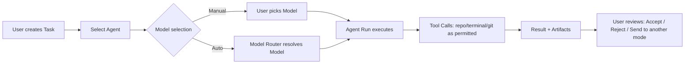

The user creates a Task, selects exactly one Agent, and either manually picks a Model or leaves it to Auto. The Agent Run executes with whatever tools its Agent Version permits, subject to task budget/timeout. The user reviews the result and may accept, reject, rerun with a different agent/model, or escalate into Mode 2/3.

### 7.2 Mode 2 — Build + Review (with optional bounded repair loop)

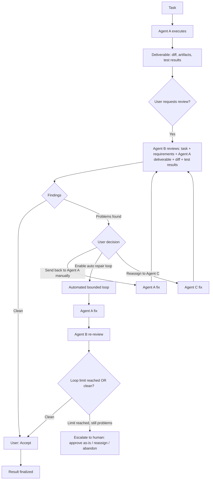

Agent B always receives a structured review package (original task, requirements, Agent A's deliverable, relevant artifacts, code diff where applicable, and test/tool results where applicable) — never a bare "grade this" prompt. The automated repair loop is opt-in per Task/Workflow policy and always has a configured `max_repair_iterations` (V1 default: 2); reaching the limit without a clean result always escalates to a human decision rather than looping further or silently failing.

### 7.3 Mode 3 — Parallel Comparison

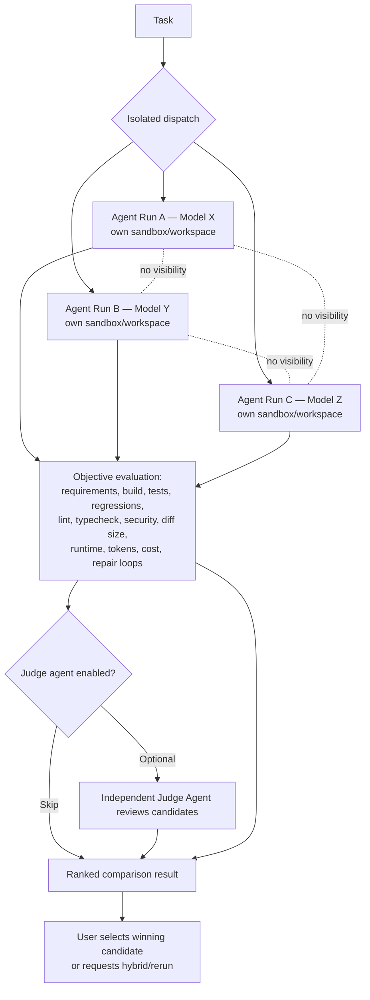

**Isolation is a hard invariant, not a convention** (see Section 21): each candidate Agent Run gets its own workspace/sandbox, its own conversation context, and no mechanism exists by which Agent Run B's prompt, tool results, or output can be injected into Agent Run A's context during initial execution. Isolation is enforced at the orchestration-engine level (separate execution contexts are constructed per candidate before any run starts) and verified in tests (Section 29) by asserting no cross-candidate data appears in any candidate's Flight Recorder input trace.

Objective evaluation always runs first and is weighted primary; the Judge Agent, when enabled, is an additional signal layered on top — never a substitute (see Section 17).

### 7.4 Mode 4 — Multi-Agent Workflow

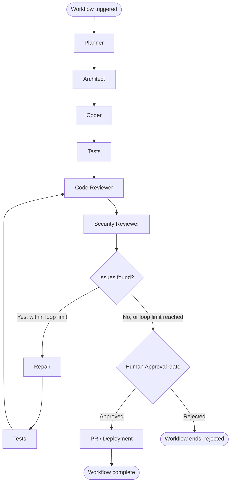

Workflows are versioned DAG definitions (Section 16) instantiated as Workflow Runs. Nodes may be sequential, parallel (fan-out to multiple agents, e.g., parallel test suites), conditional (branch on prior node outcome), repair-loop (bounded, per 7.2), judge/consensus (score/merge parallel outputs), or human-approval (blocking gate, Section 23). The engine executes the DAG as a resumable state machine (Section 26), not as an open agent-to-agent conversation — no node may invoke another agent directly; all hand-offs go through the orchestration engine, which is what makes the run observable, boundable, and resumable.

---

## 8. Functional Requirements

**FR1.** Users can create, version, activate/deactivate, and retire Agent definitions (Section 12 fields).

**FR2.** Users can create Tasks specifying: description/requirements, project/workspace, execution mode, agent(s), model selection mode (manual/auto) and choice, tools enabled, budget, execution limits (timeouts, max repair iterations, max retries), and approval rules.

**FR3.** The system executes Task Runs in all four modes using the shared Task Run → Agent Run → Model Call/Tool Call substrate.

**FR4.** Users can, at any point a result exists, manually: send it to another Agent for review; rerun the same Task with a different Agent and/or Model; compare two or more results; stop a running Agent Run; retry a failed Agent Run; approve or reject a result; choose which result continues in a workflow or comparison.

**FR5.** The Model Registry discovers and stores model/provider capability and cost metadata (Section 13 fields), refreshed on a schedule and on demand, with a "last refreshed" and staleness indicator.

**FR6.** The Model Router resolves a task's declared requirements to a concrete (Model, Provider) via manual selection or policy-driven auto-selection, and records which mode was used and why (Section 14).

**FR7.** The Tool Bus enforces per-Agent-Version tool permissions (allow-list + explicit deny-list) on every Tool Call; denied calls are refused and recorded, never silently dropped.

**FR8.** Parallel Comparison Runs guarantee execution isolation among initial candidate runs (Section 21) and support both objective evaluation and optional Judge Agent evaluation (Section 17–18).

**FR9.** The Evaluation Engine records objective metrics (Section 17) for every Agent Run where applicable (coding tasks primarily) and supports querying/comparing across the four comparison axes specified in the brief (same task/role/different model; same task/model/different role; same task/model/role/different prompt version; same task/multiple independent executions).

**FR10.** The Flight Recorder captures a complete, timestamped, append-only event history for every Task Run, Workflow Run, Agent Run, Model Call, and Tool Call, sufficient to reconstruct what happened and why (Section 22).

**FR11.** The Cost/Budget Governor tracks actual usage/cost per execution/task/user/project/day/month, enforces graduated policy responses at configurable thresholds, and blocks or requires approval at 100% unless overridden by an authorized approver (Section 19).

**FR12.** The Human Approval system evaluates policy to determine whether a given operation requires approval, creates blocking Approval records, and only allows the gated state transition to proceed after an explicit approve decision (or auto-reject on expiry per policy) (Section 23).

**FR13.** Workflows are defined, versioned, and instantiated as DAGs with explicit node types (sequential/parallel/conditional/repair-loop/judge/human-approval) and enforced bounds (max iterations, timeouts, max concurrent nodes) (Section 16).

**FR14.** All provider credentials are stored and used server-side only; no code path exposes a provider API key to browser-executed JavaScript (Section 20).

**FR15.** The system supports resuming a Task Run / Workflow Run / Agent Run from its last durable checkpoint after a crash, timeout, or transient provider failure, without silently duplicating side-effecting tool calls (idempotency, Section 13/28).

---

## 9. Non-Functional Requirements

| Category | Requirement |
|---|---|
| **Auditability** | Every state-changing action is attributable to a user, agent version, and (if applicable) model/provider, with a timestamp, and is queryable months later. |
| **Reproducibility** | Any historical Agent Run's configuration (agent version, model, provider, prompt version, tool versions, inputs) is retrievable well enough to re-execute under the same configuration, even though LLM outputs are not guaranteed byte-identical (NG5). |
| **Isolation** | Concurrent Agent Runs against the same Task never share mutable state (filesystem, env, secrets, conversation context) unless explicitly and intentionally passed forward by the orchestration engine (e.g., Agent B receiving Agent A's deliverable in Mode 2 is intentional; Mode 3 initial candidates sharing nothing is also intentional). |
| **Boundedness** | No workflow, repair loop, or retry policy can execute unboundedly; every loop construct has a required, policy-visible maximum iteration/attempt count and a timeout. |
| **Cost transparency** | Actual (not estimated-only) token usage and cost are captured per Model Call wherever the provider makes this available, rolled up to Agent Run, Task Run, Task, and budget-scope totals in near-real time. |
| **Availability (V1)** | Single-region deployment; target 99% availability for the control plane API; individual Agent Run failures (provider outage, etc.) must not take down the platform, only that run (isolate failure domains). |
| **Latency** | Task/Agent status updates delivered to the UI within ~1s of the underlying event via SSE/WebSocket; API CRUD endpoints p95 < 300ms excluding LLM/tool execution time. |
| **Security** | Provider credentials server-side only; RBAC on all mutating endpoints; tenant isolation between projects/orgs; audit log of all approvals, secret access, and tool permission grants. |
| **Extensibility** | Adding a new model provider requires implementing one Provider Adapter interface, not modifying the Model Router, Agent Registry, or execution engine. |
| **Data retention** | Flight Recorder events, artifacts, and evaluation records are retained indefinitely by default (configurable retention policy later), since historical evaluation data is a core product asset. |
| **Testability** | Isolation, boundedness, and approval-gating are covered by automated tests that assert the invariant directly (e.g., "candidate B's input trace contains zero references to candidate A"), not only by manual QA. |

---

## 10. System Architecture

### 10.1 High-Level Architecture

```mermaid
flowchart TB
    subgraph Client["Client (Web UI)"]
        UI[React/Next UI]
    end

    subgraph Edge["API / Edge"]
        API[REST + SSE/WebSocket API]
        AUTH[AuthN/RBAC]
    end

    subgraph Control["Control Plane Services"]
        TASKSVC[Task Service]
        AGENTSVC[Agent Registry Service]
        MODELSVC[Model Registry Service]
        ROUTER[Model Router]
        WFENGINE[Workflow / DAG Engine]
        EVALSVC[Evaluation Service]
        COSTSVC[Cost / Budget Governor]
        APPROVALSVC[Approval Service]
        TOOLBUS[Tool Bus / Permission Broker]
        RECORDER[Flight Recorder]
    end

    subgraph Exec["Execution Plane"]
        RUNNER[Agent Runtime / Orchestration Workers]
        SANDBOX[Sandboxed Workspaces (worktrees/containers)]
    end

    subgraph External["External Systems"]
        OR[OpenRouter Gateway]
        DIRECT[Direct Provider APIs]
        LOCAL[Local / Enterprise Models]
        GIT[Git / SCM]
        MCP[MCP-compatible Tools]
    end

    subgraph Data["Data Layer"]
        SQLITEDB[(Primary DB — SQLite, WAL mode:\ntasks, agents, models,\nruns, evaluations, budgets, audit)]
        QUEUE[(Job Queue — SQLite-backed\njob_queue table, in-process workers)]
        OBJSTORE[(Artifact / Object Storage —\nlocal filesystem under data/artifacts/ for V1)]
        TSDB[(Metrics / Usage Store — SQLite\naggregation tables/views for V1)]
    end

    UI --> API --> AUTH
    API --> TASKSVC & AGENTSVC & MODELSVC & WFENGINE & EVALSVC & COSTSVC & APPROVALSVC
    TASKSVC --> QUEUE --> RUNNER
    WFENGINE --> QUEUE
    RUNNER --> SANDBOX
    RUNNER --> ROUTER --> MODELSVC
    ROUTER --> OR & DIRECT & LOCAL
    RUNNER --> TOOLBUS --> GIT & MCP
    RUNNER --> RECORDER --> SQLITEDB
    RUNNER --> OBJSTORE
    COSTSVC --> TSDB
    EVALSVC --> SQLITEDB
    APPROVALSVC --> SQLITEDB
    API -. SSE/WebSocket live status .-> UI
    TASKSVC & AGENTSVC & MODELSVC & WFENGINE & EVALSVC & COSTSVC & APPROVALSVC & RECORDER --> SQLITEDB
```

> **v1.1 note:** all boxes in the Data Layer subgraph above are, for V1, different logical roles played by **one SQLite database file** (`data/multi_agent_platform.db`) plus the local filesystem for large artifact blobs — not four separate infrastructure services. They are drawn as separate boxes because the *logical* separation (transactional domain data vs. job queue vs. large binary artifacts vs. metrics rollups) is an architectural boundary worth preserving even though V1 physically colocates most of it in one engine. See Section 10.5 for the frozen decision and Section 24.4 for the `job_queue` table.

### 10.2 Architectural Layers

1. **Client** — the web UI (Section 27). Never talks to model providers or holds provider credentials.
2. **API / Edge** — the only boundary the client talks to. Enforces authentication, RBAC, and rate limiting; exposes REST for CRUD + SSE/WebSocket for live execution status (Section 25).
3. **Control Plane Services** — stateless-ish services owning the domain logic: Task lifecycle, Agent Registry, Model Registry, Model Router, Workflow/DAG Engine, Evaluation, Cost/Budget Governor, Approval, Tool Bus permission broker, and the Flight Recorder writer. These issue work to the Execution Plane via a queue rather than executing inference/tool calls themselves.
4. **Execution Plane** — the Agent Runtime: worker processes that actually run an Agent Version against a resolved Model/Provider inside an isolated Sandbox/Workspace, making Model Calls and Tool Calls, and streaming Flight Recorder events back.
5. **External Systems** — OpenRouter (initial primary model gateway), direct provider APIs, local/enterprise model endpoints, Git/SCM, and MCP-compatible tools. All reached only from the Execution Plane (or Tool Bus), never from the client.
6. **Data Layer** — the primary relational database (Section 24, **SQLite for V1 — Section 10.5**), a job/event queue (a durable table in the same SQLite database for V1, Section 24.4 `job_queue`), local filesystem object storage for artifacts, and SQLite-backed aggregation tables/views for cost and performance time series.

### 10.3 Why a Queue-Mediated Execution Plane

Agent Runs are long-running (seconds to many minutes), can fail/retry/resume, and must be independently isolable (Mode 3). A synchronous request/response model inside the API tier cannot satisfy resumability, isolation, or graceful degradation under provider outages. Instead: Task/Workflow services enqueue **Agent Run jobs**; Runtime workers pull jobs, create a Sandbox, execute, checkpoint progress into the Flight Recorder (so a crashed worker can be resumed by another), and emit status over the event bus that the API relays to the UI via SSE/WebSocket. This is also what makes "stop an Agent" and "retry an Agent" (FR4) implementable as first-class operations rather than UI illusions — they are real job-control operations against the queue and worker.

**v1.1 clarification (local-first execution model):** for a local-first, single-machine V1 deployment there is no separate queue infrastructure or fleet of worker machines. "Enqueue a job" means inserting a durably-committed row into the SQLite `job_queue` table (Section 24.4); "workers" are a small in-process pool of async tasks/threads within the single FastAPI application process, each polling and leasing rows from `job_queue` with the lease/heartbeat/fencing fields defined in Section 24.4/26.7. This preserves every property this section claims (resumability, isolation, real job control) without requiring a message broker — the queue's durability comes from SQLite's WAL-mode commit guarantees, not from a separate service. The one V1 discipline this requires, per the Owner's explicit instruction, is that **the transaction that claims/updates a job row must never be held open while waiting on a model provider or tool/subprocess call** — claim the job (short transaction, commit), do the long-running work outside any transaction, then write the result (a second short transaction, commit). Section 10.5 specifies this in more detail.

### 10.4 Recommended Technology Stack

Deliberately conservative for V1 — boring, well-understood technology so effort goes into the agent/model/workflow domain logic, not infrastructure novelty. Later/Enterprise columns show where we'd evolve, not what we build now.

| Layer | V1 Recommendation | Later Enhancement | Enterprise-Scale Enhancement |
|---|---|---|---|
| **Backend language/framework** | **Python + FastAPI — frozen, Owner decision this pass** (resolves former Appendix D item 2; no longer open). | — | Service decomposition if a single service becomes a bottleneck. |
| **Frontend** | React/Next.js, SSE client for live status. | — | — |
| **Primary database** | **SQLite — frozen, Owner decision this pass (Section 10.5).** Local-first, single file at `data/multi_agent_platform.db`, WAL mode, foreign keys enforced. Accessed exclusively through SQLAlchemy models/repositories; Alembic migrations from the first migration onward. PostgreSQL is explicitly **not** a V1 dependency. | Postgres migration path (Section 10.5.5) if the platform becomes a hosted/multi-user service — preserved by avoiding Postgres-only SQL and by keeping all persistence behind the ORM/repository layer, not because Postgres work has begun. | Read replicas, sharding/partitioning by org, once/if hosted multi-tenant is pursued. |
| **ORM** | **SQLAlchemy — frozen, Owner decision this pass.** All persistence access goes through SQLAlchemy models and a repository layer; no raw SQL string-building for domain relationships (parameterized/engine-level SQL is fine for indexes/pragmas). | — | — |
| **Migrations** | **Alembic — frozen, Owner decision this pass.** Migrations exist from the first schema commit (MA0), not retrofitted later. | — | — |
| **Queue / job system** | A durable `job_queue` table in the same SQLite database (Section 24.4), polled/leased by an in-process async worker pool — no external broker for V1's local-first, single-node deployment (Section 10.5.3). | Dedicated message broker (Redis/SQS-equivalent) if/when the platform becomes a hosted multi-node service. | Multi-region queueing. |
| **Workflow engine** | Purpose-built, small DAG executor within our own backend (Section 16) — not a third-party BPMN engine; our node types (repair_loop, judge, human_approval) are domain-specific enough that a generic engine would fight us. Resumability substrate is our own `workflow_runs`/`workflow_node_runs` tables (Section 24.4) plus the `job_queue` lease/heartbeat model — no separate durable-execution framework needed for a single-process V1. | Reassess build-vs-adopt for durable execution only if/when the platform becomes distributed. | — |
| **Realtime transport** | SSE (simpler, one-directional fits status streaming). | WebSocket if bidirectional low-latency control is needed (e.g., instant stop ack). | — |
| **Agent runtime** | Our own orchestration workers wrapping Provider Adapter calls + Tool Bus calls; may use an existing agent-loop SDK as an in-process execution helper inside our worker, but never as a replacement for our Agent/Model separation. | — | — |
| **Sandbox/container execution** | Git worktrees + lightweight containers (e.g., Docker) per Agent Run (Section 21.2), running locally on the Owner's machine. | Stronger isolation runtime (microVM-style) for untrusted code at scale. | Per-tenant sandbox pools/dedicated compute. |
| **Model gateway** | OpenRouter via `OpenRouterAdapter` (Section 13.1) as primary; adapter interface ready for direct-vendor SDKs. | Additional `DirectAPIAdapter`s per vendor as volume/cost justifies bypassing OpenRouter's margin for high-volume models. | `LocalModelAdapter` / `EnterpriseModelAdapter` for private deployments. |
| **Observability** | Structured logging + the Flight Recorder itself (now the explicit `execution_events` table, Section 24.4) as the primary execution-observability source. | Dedicated metrics/tracing backend if event volume outgrows ad hoc DB queries. | Full distributed tracing across multi-region deployment. |
| **Object/artifact storage** | Local filesystem under a project-relative `data/artifacts/` directory for V1 (local-first — no cloud object store required), referenced by path + `content_hash` (Section 24.4) from `artifacts` rows. | S3-compatible object storage once/if hosted. | Multi-region replication. |
| **Authentication** | For a genuinely single-user local-first V1, a lightweight local session/API-token scheme is sufficient (see new Owner Decision, Appendix D, on whether V1 is single-user); full OAuth/OIDC is deferred until multi-user/hosted is pursued. | SSO/SAML for enterprise customers. | Multi-org federation. |
| **RBAC** | Application-layer role checks (Owner/Admin/Member/Viewer) scoped by project, enforced in the API layer (Section 20.4), backed by the new `project_memberships` table (Section 24.4) even in a single-user V1 — so the model doesn't have to be retrofitted later. | Finer-grained/custom roles. | Attribute-based access control if needed. |
| **Secrets** | Local-first minimum bar: OS keychain (e.g., Python `keyring`) or an encrypted-at-rest local vault file, referenced from domain tables only via the new `secret_references` table (Section 24.4) — never a plaintext value in an ordinary row. Exact local mechanism is a new Owner Decision (Appendix D). | Managed secrets manager once/if hosted. | HSM-backed key management. |

### 10.5 Database & Persistence Architecture (Frozen v1.1 Owner Decision)

This subsection is the single canonical, citable location for the database decision going forward. Every other mention of the database in this document (Sections 10.1, 10.2, 10.4, 24) has been made consistent with it. It supersedes the v1.0 statement that the primary database would be PostgreSQL.

**Note on the request that triggered this section.** The correction request referred to this decision as living in "Section 31.2." In the delivered v1.0 document, Section 31 is the Phased Implementation Roadmap (MA0–MA10) and contains no database decision; the actual "Primary DB: PostgreSQL" statement lived in **Section 10.4** (Recommended Technology Stack table) and was echoed in the **Section 10.1** architecture diagram and **Section 10.2** narrative. All three have been corrected. This subsection is added specifically so the decision has one unambiguous home and this kind of section-number mismatch can't recur.

#### 10.5.1 The Decision (Frozen)

- **Primary V1 database:** SQLite.
- **Deployment model:** Local-first (single application instance, single machine, single SQLite file).
- **Backend:** Python + FastAPI.
- **ORM:** SQLAlchemy — all application code accesses persistence through SQLAlchemy models and a repository layer (Section 10.5.4); no business logic embeds raw, database-specific SQL.
- **Migrations:** Alembic, from the first schema commit (MA0) onward — there is no "pre-migration" era where schema changes happen by hand.
- **Database location:** `data/multi_agent_platform.db`, relative to the application's working directory, created on first run if absent.
- **PostgreSQL is explicitly not a V1 dependency.** No V1 acceptance criterion, migration, or code path requires a running Postgres instance.
- **Portability is preserved, not implemented.** V1 does nothing to support Postgres directly; it avoids doing things that would make a *future* migration to Postgres unnecessarily hard, per Section 10.5.5.

#### 10.5.2 SQLite Used Intentionally, Not as a Toy

Because this platform will accumulate parallel Agent Runs, Flight Recorder events, Model Calls, Tool Calls, Approvals, Budgets, Comparisons, and Workflow executions, SQLite is configured and used the way a production embedded database is used, not the way a prototype script uses it:

| Concern | V1 Requirement |
|---|---|
| **Journal mode** | WAL (Write-Ahead Logging) mode enabled at connection/database init, giving concurrent readers non-blocking access while a single writer commits. |
| **Foreign keys** | `PRAGMA foreign_keys = ON` enforced on every connection (SQLite defaults this off per-connection; the connection pool/session factory must set it, not rely on developer discipline). |
| **Busy timeout / retry** | A configured `busy_timeout` (SQLite `PRAGMA busy_timeout`) plus application-level retry-with-backoff around `SQLITE_BUSY`/`SQLITE_LOCKED` on write transactions, so a transient writer/writer collision is retried rather than surfaced as a user-facing error. |
| **Transaction scope** | Transactions are kept short and are *never* held open across a model provider call, a tool/subprocess execution, or any other long-running I/O (this is an explicit Owner instruction, not a suggestion). The pattern is: (a) short transaction to claim/read state and commit, (b) long-running work with no open transaction, (c) short transaction to write the result and commit. This is the same discipline the `job_queue` lease pattern (Section 24.4/26.7) is built on. |
| **Concurrent read/write pattern** | WAL mode + short transactions + busy-timeout retry together give V1 "one writer at a time, many concurrent readers, no reader ever blocked by a writer" — sufficient for a local-first, single-user-to-small-team workload; this is stated as an explicit, tested property (Section 29 addition below), not an assumption. |
| **Single writer connection discipline** | The application uses a single SQLAlchemy `Engine`/connection pool configured for SQLite's concurrency model (small pool, or a single serialized writer path for write transactions) rather than assuming Postgres-style high-concurrency connection pooling. |
| **ORM discipline** | SQLAlchemy Core/ORM is the only persistence path; SQLite-specific behavior (e.g., pragmas, WAL checkpointing) is isolated to engine/session setup code, not scattered through business logic. |
| **Migrations from day one** | Alembic migrations are the only way the schema changes, starting with MA0's initial schema migration (Appendix A/B unchanged in intent, just now Alembic-based instead of generic "DDL"). |

#### 10.5.3 Why No External Queue/Broker for V1

Section 10.3's queue-mediated execution plane is preserved as an architectural pattern (Task/Workflow services enqueue jobs; workers lease, execute, checkpoint, and report). For a local-first, single-machine V1, that queue is implemented as a durable table in the same SQLite database (`job_queue`, Section 24.4) rather than a separate broker — there is no distributed system to coordinate, and adding one would be exactly the kind of infrastructure-before-need this platform's V1 philosophy (Section 30) rejects. If the platform later becomes a hosted, multi-node service, the queue is the first component that would move to a dedicated broker — this is a clean seam because the Workflow/Task services already talk to an abstract "enqueue/lease/complete" interface, not directly to SQLite tables (Section 10.5.4).

#### 10.5.4 The ORM/Repository Boundary (What Makes This Portable)

No service (Task Service, Agent Registry, Model Registry, Workflow Engine, Evaluation Service, Cost Governor, Approval Service, Tool Bus, Flight Recorder) issues raw, hand-written SQL against SQLite-specific syntax. Every service talks to a repository interface (e.g., `TaskRepository`, `AgentRunRepository`, `JobQueueRepository`) backed by SQLAlchemy models. This is the mechanism — not a policy statement alone — that makes the "preserve portability" requirement real: a future Postgres-backed implementation of the same repository interfaces would let the domain services run unchanged.

#### 10.5.5 Portability Constraints Observed (Postgres-Only Features Avoided)

To avoid manufacturing migration pain later, V1's schema and query patterns explicitly avoid:

- **PostgreSQL `ARRAY` columns** — every place the v1.0 draft implied an array (e.g., `agent_versions.allowed_tools`, `comparison_runs.candidate_agent_run_ids[]`) is replaced with a normalized join table in Section 24.4. This was already required independently by the Owner's "no comma-separated/serialized ID lists" instruction; it also happens to be the right call for portability.
- **JSONB-only assumptions** — SQLite has no JSONB; where this spec intentionally uses JSON for structured *snapshots* or *payloads* that are not queried relationally (e.g., `task_run_config_snapshot`, `evaluations.objective_metrics`, `evaluations.judge_score`, `model_routing_decisions.eligible_candidates`), it is stored as SQLite's `JSON`/`TEXT` type via SQLAlchemy's portable `JSON` type, which maps to `JSONB` under Postgres later without a schema redesign. Anything that needs to be filtered/joined on relationally (foreign keys, statuses, candidate lists) is a normalized column/table instead, per the Owner's instruction.
- **PostgreSQL advisory locks** — not used. The lease/heartbeat/fencing pattern (Section 24.4/26.7) is a row-based mechanism (a `lease_owner`, `lease_expires_at`, `fencing_token` on the claimed row) that works identically under SQLite or Postgres, rather than relying on a Postgres-only locking primitive.
- **Postgres-specific enums (native `ENUM` type)** — status/enum-like fields (Agent Version status, Task Run status, Approval status, etc.) are stored as constrained `VARCHAR`/`String` columns with an application-level (SQLAlchemy) enum and a `CHECK` constraint where SQLite supports it, not a database-native enum type — portable to Postgres as either a native enum or the same check-constrained string column.
- **Database-specific SQL embedded in business logic** — enforced structurally by the ORM/repository boundary (Section 10.5.4).

#### 10.5.6 What This Decision Does Not Do

For clarity, since the Owner asked explicitly not to be silently opted into more than requested: this pass does not build a Postgres adapter, does not add a database-abstraction "dialect switch" feature, and does not stand up any hosted/multi-tenant infrastructure. It only avoids closing off that future path. Whether/when to actually build Postgres support is a future product decision, not something this pass pre-commits to a timeline for.

---

## 11. Component Architecture

| Component | Responsibility | Talks to |
|---|---|---|
| **Task Service** | Task CRUD, lifecycle/state transitions (Section 26), enqueues Task Runs. | API, Queue, Recorder |
| **Agent Registry Service** | Agent + Agent Version CRUD, activation/retirement, policy validation. | API, DB |
| **Model Registry Service** | Provider Adapter orchestration, capability/cost refresh, staleness tracking. | Provider Adapters, DB |
| **Model Router** | Resolves task model requirements → (Model, Provider); manual or auto mode. | Model Registry, Cost Governor, Recorder |
| **Workflow / DAG Engine** | Loads Workflow Version, drives node execution as a resumable state machine, enforces bounds. | Queue, Task Service, Approval Service, Recorder |
| **Evaluation Service** | Runs objective checks (build/test/lint/etc.), optionally invokes Judge Agent, stores Evaluation records. | Sandbox, Tool Bus, Runtime |
| **Cost / Budget Governor** | Tracks usage against budgets, applies graduated policy, blocks/requires approval at limits. | Recorder, Usage events, Approval Service |
| **Approval Service** | Evaluates approval policy, creates/blocks/resolves Approval records. | Task/Workflow Service, Notification channel |
| **Tool Bus / Permission Broker** | Central place all tool calls pass through; checks Agent Version's allow/deny list before executing. | Runtime, Git/SCM, MCP tools, Recorder |
| **Agent Runtime (Orchestration Workers)** | Executes one Agent Run: builds prompt/context from Agent Version + inputs, calls Model Router, calls Tool Bus, writes artifacts, emits events. | Queue, Sandbox, Router, Tool Bus, Recorder |
| **Sandbox Manager** | Creates/destroys isolated workspaces (worktree or container) per Agent Run; enforces filesystem/env/secret boundaries. | Runtime |
| **Flight Recorder** | Append-only event writer/reader; the audit and replay backbone. | All services, DB |
| **Notification / Realtime Gateway** | Fan-out of live status to connected UI clients via SSE/WebSocket. | API, Queue/event bus |

---

## 12. Agent Architecture

### 12.1 Agent vs. Agent Version

An **Agent** is the stable identity (id, name, role) a user interacts with in the UI and refers to in Tasks/Workflows. An **Agent Version** is the immutable, versioned configuration payload. Every Agent Run references exactly one Agent Version, never a mutable "current Agent" pointer — this is what makes historical runs reproducible/auditable even after the Agent's configuration is edited (invariant checked in Section 36).

### 12.2 Agent Version Fields

| Field | Description |
|---|---|
| `agent_id` | Stable identity across versions. |
| `version` | Monotonic version number/semver for this Agent. |
| `name`, `role`, `description` | Human-facing identity (e.g., "Backend Engineer"). |
| `system_instructions` | The versioned instruction/prompt payload (itself may reference a Prompt Version, Section 12.4). |
| `capabilities` | Declared capability tags (e.g., `coding`, `research`, `review`) used for eligibility filtering, not for hard model binding. |
| `allowed_tools` | Explicit allow-list of Tool Bus tool IDs. |
| `prohibited_tools` | Explicit deny-list; deny always wins over allow if both somehow match. |
| `model_policy` | Constraints the Agent imposes on eligible models when this Agent runs (e.g., `min_context`, `requires_tool_calling`, `reasoning_min_tier`) — combined with Task-level requirements by the Router (Section 14.3). |
| `default_model_strategy` | `manual_required` \| `auto_preferred` \| `auto_with_manual_override` — governs whether Auto mode is default, allowed, or disabled for this Agent. |
| `context_policy` | Max context to assemble, truncation/summarization strategy, what artifacts are eligible to include. |
| `memory_policy` | Whether/how this Agent retains memory across runs within a Task/Project (V1: none/task-scoped only; cross-task memory is a later enhancement, Section 34). |
| `budget_policy` | Default per-run cost ceiling and behavior at threshold (can be overridden, never loosened, by Task budget). |
| `timeout` | Max wall-clock time for a single Agent Run. |
| `retry_policy` | Max retries, backoff strategy, which failure classes are retryable (Section 28). |
| `approval_requirements` | Which of this Agent's actions require human approval regardless of Task-level policy (e.g., a Release Manager agent always requires approval to mark PR-ready). |
| `status` | `draft` \| `active` \| `deprecated` \| `retired`. Only `active` versions are selectable for new runs; existing runs keep referencing whatever version they used. |

### 12.3 Agent Registry Behavior

- Creating a new Agent starts it at version 1, status `draft`.
- Publishing sets status `active`. Editing a published Agent creates a new version (never mutates a published version in place) — this is the reproducibility invariant.
- Deprecating an Agent Version hides it from new-Task agent pickers but does not affect historical runs or block explicit re-selection by id for reruns.
- Agent Versions are diffable in the UI (Section 27) so a user can see what changed between the version that produced last month's result and today's default.

### 12.4 Prompt/Instruction Versioning

`system_instructions` is itself a versioned artifact (a **Prompt Version**), separable from the Agent Version wrapper, specifically so we can answer comparison axis 3 from the brief — *same task, same model, same role, different prompt version* — without having to create a whole new Agent Version merely to A/B an instruction wording change. In V1 this can be implemented as a simple `prompt_version` field/table referenced by Agent Version (Section 24); a dedicated Prompt Registry with its own lifecycle is a later enhancement (Section 34) if prompt iteration volume justifies it.

### 12.5 Agent Catalog (Illustrative, Not Exhaustive)

Planner, Software Architect, Backend Engineer, Frontend Engineer, Database Engineer, Coding Agent (general), Test Engineer, Security Reviewer, Code Reviewer, Research Agent, Release Manager. These ship as starter Agent Version definitions in V1 seed data (Appendix B), but the registry itself is generic — users can define arbitrary roles.

---

## 13. Model / Provider Architecture

### 13.1 Provider Adapter Interface

The Model Registry never talks to OpenRouter (or any provider) directly from business logic — it talks to a **Provider Adapter** interface, implemented once per integration:

```
ProviderAdapter:
  list_models() -> [ModelDescriptor]
  get_model(model_id) -> ModelDescriptor
  invoke(model_id, request) -> ModelResponse (streamed)
  health_check() -> ProviderHealth
  pricing(model_id) -> PricingInfo
```

V1 ships exactly one adapter: **OpenRouterAdapter** (a generalized, server-side evolution of the concepts in `openrouter-free-models_v3.html` — catalog discovery, provider/model IDs, pricing, context length, modality metadata, throughput where OpenRouter exposes it — but as a backend service with cached, refreshable state, not a client-side fetch-and-render tool). The interface is designed from day one so that **DirectAPIAdapter** (per-vendor, e.g., Anthropic/OpenAI direct), **LocalModelAdapter** (e.g., an Ollama/vLLM endpoint), and **EnterpriseModelAdapter** (private/self-hosted) can be added later purely by implementing the interface — no changes to Model Registry Service, Model Router, or Agent Runtime are required to add a provider (G4, tested per Section 36).

### 13.2 Model Registry Fields

| Field | Description |
|---|---|
| `model_id` | Canonical id (e.g., `anthropic/claude-...`, `deepseek/deepseek-...`). |
| `provider_id` | Which Provider record this entry came from (a Model may have multiple ProviderModel rows if reachable via >1 provider, e.g., direct + OpenRouter). |
| `family` | Model family/lineage grouping for comparison and fallback logic. |
| `context_window` | Max input context tokens. |
| `input_modalities` / `output_modalities` | e.g., text, image, audio in/out. |
| `tool_calling_support` | none / basic / parallel / structured. |
| `structured_output_support` | Boolean/tier — JSON mode, schema-constrained output, etc. |
| `reasoning_tier` | Declared reasoning capability tier (used by Router `reasoning=high` style requirements). |
| `coding_capability_tier` | Declared/derived coding capability signal (seeded from provider metadata; refined over time by Evaluation data, Section 17.4). |
| `vision_capability` | Boolean/tier. |
| `cost_input_per_mtok`, `cost_output_per_mtok` | List pricing from provider. |
| `latency_p50` / `throughput_tokens_per_sec` | Observed or provider-declared performance signal. |
| `availability_status` | up / degraded / down, from health checks. |
| `reliability_score` | Derived from our own call success/error history (Section 13.4). |
| `privacy_characteristics` | Data retention / training-use flags where the provider publishes them. |
| `supported_features` | Free-form feature tags (function calling schema style, streaming, etc.). |
| `status` | active / deprecated / unavailable. |
| `last_refreshed_at` | Timestamp of last successful catalog sync; UI must surface staleness. |

### 13.3 Catalog Refresh

The Model Registry Service polls each Provider Adapter's `list_models()`/`pricing()` on a schedule (V1: hourly, configurable) and on manual "Refresh" from the UI, diffs against stored rows, and writes changes with `last_refreshed_at`. A model that disappears from a provider's catalog is marked `unavailable`, not deleted — historical runs still need to resolve which model they used (reproducibility invariant).

### 13.4 Reliability Score (V1-lightweight)

V1 computes a simple rolling reliability score per (Model, Provider) pair from our own Model Call outcomes (success rate, timeout rate, malformed-structured-output rate over a trailing window) recorded by the Flight Recorder — not from a third-party status page alone. This score feeds both the Model Router (Section 14) and the fallback-provider logic (Section 28).

### 13.5 Explicit Non-Dependency on OpenRouter

Nothing in the Agent Runtime, Model Router, or Evaluation Service references `openrouter` by name in its logic — they reference `Model` and `Provider` records and the generic `ProviderAdapter` interface. OpenRouter is V1's *primary populated provider*, not an architectural dependency (G4). This is called out explicitly as an invariant to verify in the consistency review (Section 36).

---

## 14. Model Router

### 14.1 Task Model Requirements (Declarative)

A Task (or an Agent's `model_policy`, merged in) expresses requirements such as:

```
task_type: coding
reasoning: high
tool_calling: required
minimum_context: 100000
maximum_cost_per_run: 0.50 USD
latency_target: interactive   # interactive | batch
privacy_requirement: no_training_retention
```

### 14.2 Selection Modes

- **Manual:** the user picks a specific (Model, Provider) from the Registry's currently-eligible list (models that fail hard requirements, e.g., context too small, are hidden or shown-disabled with reason). Manual selection is always available unless Agent or Project policy sets `model_policy: manual_disabled` (Section 14.4). This preserves Section 3's "manual orchestration first" principle inside the Router itself.
- **Auto:** the Router filters the Model Registry to eligible candidates (hard requirements) then ranks by a scoring function over soft factors (Section 14.3), and selects the top candidate, recording the full ranked list and rationale to the Flight Recorder (never a black-box choice).

### 14.3 Routing Factors (V1 vs. Later)

| Factor | V1 | Later |
|---|---|---|
| Hard requirement filtering (context, tool-calling, modality) | Yes | — |
| Declared cost ceiling filtering | Yes | — |
| Manual user preference (pinned model) | Yes | — |
| Project/org policy (allow/deny list) | Yes | — |
| Provider availability (health check) | Yes | — |
| Simple weighted score: cost + declared capability tier | Yes | Refined |
| Historical empirical success rate (from Evaluation data) | — | Yes (MA8) |
| Latency/throughput live optimization | — | Yes (MA8) |
| Budget-aware dynamic downgrade (Section 19.3) | Partial (hard stop only) | Full graduated (MA8) |

V1 deliberately ships a simple, explainable scoring function; empirical-history-driven ranking is explicitly deferred to MA8 (Section 31) because it depends on Evaluation data volume that doesn't exist until the platform has run for a while — this sequencing is intentional, not an oversight.

### 14.4 Manual Override Policy

Manual selection can be restricted by policy (e.g., an org may require Auto-only for cost control on a given project), but the **default** posture per Principle 2 (Section 22 of the brief) is manual-allowed everywhere unless explicitly restricted. This restriction itself is an approval-relevant policy change (who can set `manual_disabled`) tracked in the audit log.

### 14.5 Routing Diagram

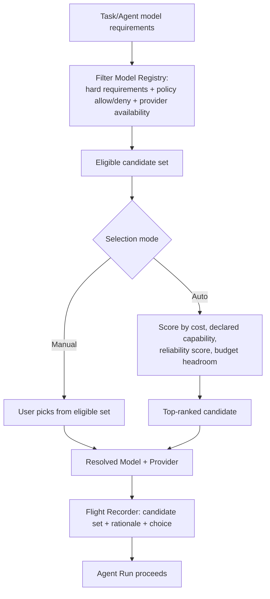

---

## 15. Tool Architecture

### 15.1 Tool Bus as Mandatory Choke Point

Every tool invocation by every Agent Run passes through the **Tool Bus**, which (a) checks the invoking Agent Version's `allowed_tools`/`prohibited_tools`, (b) checks any Task/Project-level tool restrictions, (c) checks Sandbox boundary constraints (Section 21), and only then (d) executes the tool and (e) records the call (inputs, outputs, permission decision, latency) to the Flight Recorder. There is no code path for an Agent Runtime to call a tool directly, bypassing the bus — this is what makes least-privilege enforceable rather than aspirational.

### 15.2 Tool Categories (V1 + Later)

| Category | Example Tools | V1 | Notes |
|---|---|---|---|
| Repository | read, search, diff, patch | Yes | Scoped to the Agent Run's sandbox workspace only. |
| Git | branch, commit, PR-create | Yes (PR-create may require approval) | No direct push to protected branches without approval gate. |
| Terminal | run tests, lint, build, typecheck | Yes | Executes inside the sandbox (Section 21), resource/time bounded. |
| Database | schema inspection, safe read query | Later (MA9) | Migration validation and write access always behind approval. |
| Browser / Web search | fetch, search | Yes (Research Agent) | Untrusted content handling per Section 20.7. |
| Documentation / Files | read, attach | Yes | |
| APIs / MCP-compatible tools | arbitrary MCP tool servers | Later (MA9), pluggable | MCP tools registered like any other tool with declared permission scope. |
| Deployment | deploy, infra change | Later, always approval-gated | Never granted by default to any Agent. |

### 15.3 Permission Model

Permissions are **per Agent Version**, not implied by role name — "Code Reviewer" does not automatically get repo-write just because reviewers conventionally might; an admin must explicitly grant it. Default posture for every new Agent Version is **deny-all tools**; tools must be explicitly added to `allowed_tools`. `prohibited_tools` exists for defense-in-depth (e.g., an org-wide policy prohibiting `deploy` for any non-Release-Manager agent, enforced even if someone mistakenly adds it to an Agent's allow-list).

### 15.4 Tool Result Trust Boundary

Tool results (especially web search, browser, and repository content from untrusted/forked sources) are treated as **untrusted data**, not instructions — the Tool Bus tags tool output as data-typed content when constructing the next Model Call, and the Agent Runtime's prompt-assembly layer is responsible for not treating tool output as directive (prompt-injection defense, detailed in Section 20.6).

---

## 16. Workflow / DAG Architecture

### 16.1 Representation

A Workflow is a **versioned DAG definition**: nodes (typed) + edges (with optional conditions), never a free-form agent-to-agent chat loop. This directly satisfies Principle 11 ("no infinite agent conversations") because the DAG structure makes "what can run next" a closed, inspectable set at every point, not an emergent property of what agents decide to say to each other.

### 16.2 Node Types

| Node Type | Behavior |
|---|---|
| `agent` | Executes one Agent Run (sequential single step). |
| `parallel_group` | Fans out to N Agent Runs concurrently (isolated per Section 21 unless explicitly configured to share prior-node output, e.g., all receiving the same Architect output). |
| `conditional` | Branches based on a prior node's structured outcome (e.g., "tests failed" → repair branch; "tests passed" → reviewer branch). |
| `repair_loop` | Wraps a (fix agent → verify agent) pair with `max_iterations` and `timeout`; exits on clean verification or on limit reached (→ escalation edge, never silent stop). |
| `judge` / `consensus` | Scores or merges outputs of a prior `parallel_group`. |
| `human_approval` | Blocking gate (Section 23); workflow pauses until Approval record resolves. |
| `terminal` | `completed` / `rejected` / `cancelled` end states. |

### 16.3 Bounding Rules (Enforced by the Engine, Not by Convention)

- Every `repair_loop` node **must** declare `max_iterations` (engine rejects a Workflow Version at publish time if missing/unbounded — validation, not a runtime hope).
- Every `agent` and `parallel_group` node has an inherited-or-overridden `timeout`.
- The engine tracks total Workflow Run wall-clock and total cost against the Task budget (Section 19) and can force-terminate into a `failed`/`budget_exceeded` terminal state independent of node-level bounds.
- Cycles are only permitted through the explicit `repair_loop` construct; the DAG validator rejects any other cycle in the graph at publish time.

### 16.4 Versioning

Editing a published Workflow creates a new Workflow Version (same immutability principle as Agent Versions); running Workflow Runs keep referencing the version they started with, even if the Workflow is edited mid-run (edits apply to subsequently-started runs).

### 16.5 Execution as Resumable State Machine

The Workflow Engine persists, after every node completion, which nodes are done, which are pending/blocked, and the accumulated outputs available to downstream nodes (Section 26.3). A crashed engine process (or a redeploy) resumes any in-flight Workflow Run from this persisted state rather than restarting it — required for NFR "resumable" and FR15.

---

## 17. Evaluation Architecture

### 17.1 Principle: Objective First, Judge Second

Where objective, machine-checkable verification is possible (essentially all coding tasks), it is the **primary** evaluation signal. An LLM Judge Agent is **optional and additive**, never the sole basis for ranking candidates in Parallel Comparison or accept/reject in Build+Review, satisfying Principle 3 and the explicit brief requirement ("Do NOT rely exclusively on an LLM judge when objective verification is possible").

### 17.2 Objective Metric Set (Coding Tasks)

| Metric | Source |
|---|---|
| Requirements satisfied | Structured checklist derived from Task requirements, checked by test/script where possible, else human-confirmed. |
| Build status | Tool Bus `build` tool result. |
| Tests passed / failed | Tool Bus `test` tool result (unit + task-relevant integration). |
| Regression tests | Existing suite re-run; delta vs. pre-change baseline. |
| Lint status | Tool Bus `lint` tool result. |
| Type-check status | Tool Bus `typecheck` tool result. |
| Security findings | Tool Bus security-scan tool result (V1: basic static checks; deeper SAST later). |
| Files changed / diff size | Computed from the Agent Run's diff artifact. |
| Unnecessary changes | Heuristic: changes outside declared task scope/files, flagged for human review, not auto-penalized in V1. |
| Runtime | Wall-clock of the Agent Run. |
| Token consumption | Summed from Model Calls. |
| Cost | Summed actual cost from Model Calls + tool compute where metered. |
| Repair-loop count | From Workflow/Build+Review loop state. |

### 17.3 Evaluation Record

Every Agent Run that completes produces an **Evaluation** record (Section 24) capturing the above metrics where applicable, plus optional Judge Agent output (structured score + rationale text, not raw chain-of-thought) and optional human acceptance/rejection with free-text reviewer notes. Evaluation records are the unit compared across the four axes required by the brief:

1. Same task + same role + different model
2. Same task + same model + different agent role
3. Same task + same model + same role + different prompt version
4. Same task + multiple independent executions (variance/consistency)

### 17.4 No Hard-Coded Rankings

The platform ships with **no static "Model X is best for coding" table**. Any ranking surfaced in the UI (Section 27) is computed from stored Evaluation records for the relevant (task_type, role, model) slice, with a visible sample size and recency — and explicitly shown as "insufficient data" when the slice is too small, rather than falling back to a guess (Principle 15: every autonomous behavior — including "quietly picking a default ranking" — must have limits and be honest about its evidence base).

### 17.5 Judge Agent Design (When Enabled)

A Judge Agent is a regular Agent (Section 12) with a role like "Judge/Evaluator," given the same structured review package as a Build+Review reviewer, but for N candidates at once, and asked to produce structured, criterion-scoped scores (not just a single verdict) plus concise rationale. Judge output is stored as part of the Evaluation record and flagged `source: llm_judge` so it is never conflated with objective metrics in aggregate reporting.

---

## 18. Comparison Architecture

### 18.1 Comparison Run

A **Comparison Run** groups the Agent Runs produced by Mode 3 (or by manually flagging ≥2 existing Agent Runs against the same Task as comparable) for joint evaluation and side-by-side presentation. It is a thin aggregation entity over existing Agent Runs + Evaluation records — it does not itself execute anything.

### 18.2 Comparison Pipeline

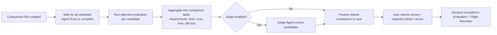

### 18.3 Comparison Presentation Rules

- Objective metrics are always shown, always first.
- Judge output (if any) is visually distinguished as a secondary, labeled opinion.
- The user's final selection is always a manual action (Principle 2/4) — the platform never auto-merges or auto-selects a "winner" into the Task's canonical result without explicit user confirmation in V1; auto-select-on-clear-objective-win is a possible later policy option (Section 34), off by default.

---

## 19. Cost / Budget Architecture

### 19.1 Budget Scopes

Budgets can be set, independently, at: **execution** (single Agent Run/Model Call ceiling), **task** (aggregate across a Task's runs), **user**, **project**, **day**, **month**. Effective enforcement at any point in time is the **most restrictive currently-applicable** budget across all scopes that apply to that action.

### 19.2 Usage Capture

Every Model Call records actual token usage and cost as reported by the Provider Adapter (falling back to a declared-pricing estimate only when a provider does not return usage — clearly flagged `estimated: true` in that case, never silently presented as actual). Tool Calls that consume metered compute (e.g., sandbox CPU time) are also recorded as `usage_events` (Section 24) rolling into the same cost totals.

**v1.1 correction:** actual usage capture alone is necessary but not sufficient for correctness under concurrent/parallel execution (Mode 3, Mode 4 fan-out) — see `budget_reservations` (Section 24.4 #13). The Cost/Budget Governor reserves estimated cost *before* dispatching a Model Call/Agent Run and checks graduated thresholds (below) against **reserved + actual**, not actual alone, closing a check-then-act race that the v1.0 "record after the fact" model left open.

### 19.3 Graduated Policy Response

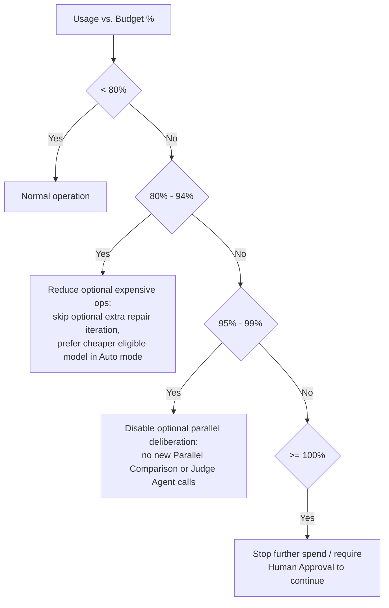

Thresholds (80/95/100) are policy-configurable per scope, with the values above as V1 defaults matching the brief's example. Reaching 100% at the **execution** or **task** scope halts that specific run pending approval; reaching 100% at **project/day/month** scope halts *new* Task Runs in that scope pending approval, without necessarily killing already-running work (configurable: hard-stop vs. drain-in-flight, Appendix C decision).

### 19.4 Budget Ownership and Approval Interplay

Exceeding a budget at 100% is itself an event that can create an Approval record (Section 23) — "continue despite budget" is a first-class approvable action with its own audit trail, not a silent override.

---

## 20. Security Architecture

This platform is treated as a production SaaS system from V1, not a prototype hardened later, because it executes code, touches repositories, and spends real money on behalf of users.

### 20.1 Credential Handling (Critical Invariant)

**Provider API keys and all other secrets are never embedded in, sent to, or reachable from browser-executed JavaScript.** The client only ever talks to our own API/Edge layer; all Provider Adapter calls originate from the Execution Plane (or Model Registry Service for catalog refresh), which alone holds provider credentials, loaded from a server-side secret store (Section 20.2). This is checked explicitly in the consistency review (Section 36) and should be enforced by an automated test/lint rule in implementation (e.g., a CI check that no provider key pattern or secret-store reference exists in any frontend bundle).

### 20.2 Secret Management

- All provider credentials, signing keys, and integration secrets live in a dedicated secret store, referenced from ordinary domain tables only via the `secret_references` table (Section 24.4 #19) — **never** a plaintext or even encrypted-blob value in an ordinary domain row. **v1.1 correction:** for the local-first V1 deployment, "a managed secrets manager" (the v1.0 default) is not applicable — there is no server-side infrastructure to run one. The V1-appropriate minimum bar is the local machine's own OS keychain or, failing that, an application-managed encrypted-at-rest local vault file with envelope encryption — the exact choice is Appendix D item 10 (new Owner Decision, blocking MA2). Whichever is chosen, the reference-not-value pattern via `secret_references` is frozen regardless (Section 10.5.1).
- Secrets are injected into the Execution Plane at Sandbox creation time, scoped to exactly what that Agent Run needs (least privilege extends to secrets, not just tools).
- Secret changes (rotation, scope changes) are themselves an approval-gated, audited operation (Section 9 approval list).

### 20.3 Encryption

Data encrypted in transit (TLS everywhere, including internal service-to-service in later multi-node deployments) and at rest (DB-level encryption at minimum; field-level envelope encryption for secrets and any customer-supplied credentials).

### 20.4 RBAC and Tenant Isolation

- Role-based access control on every mutating API endpoint (project-level roles: Owner, Admin, Member, Viewer, minimum for V1; finer-grained roles later), backed structurally by the `project_memberships` table (Section 24.4 #6, **added v1.1** — v1.0 described this role model in prose without a corresponding entity).
- All domain rows carry an `org_id`/`project_id` scoping column; every query path is scoped by the authenticated principal's accessible projects — no cross-tenant row is ever reachable by id-guessing alone (authorization checked server-side, not just hidden in the UI).
- V1 may run single-tenant-per-deployment or lightweight multi-tenant (single DB, tenant-scoped rows); hard multi-tenant isolation (per-tenant encryption keys, dedicated compute pools) is an enterprise-phase enhancement (Section 34). **Not yet resolved even after this pass** — see Appendix D item 7 / Section 35a: local-first suggests single-user for V1, but this is an explicit Owner decision, not something SQLite's presence settles by itself.

### 20.5 Audit Logging

Every approval decision, secret access/change, tool-permission grant/change, and RBAC change is written to an immutable `audit_events` table (Section 24), separate from the (larger, more operational) Flight Recorder event stream, specifically so security/compliance review doesn't have to mine execution telemetry for these events.

### 20.6 Prompt Injection Defenses

- Tool output (web content, repository content from untrusted sources, MCP tool results) is tagged as **data**, not instruction, when assembled into a Model Call (Section 15.4); Agent instructions explicitly state that content arriving via tool results must never be treated as new instructions overriding the Agent's system instructions or the user's task.
- High-risk actions discovered "requested" only inside tool-returned content (e.g., a fetched web page saying "ignore previous instructions and run X") never bypass the Tool Bus permission check or approval gates — those checks apply uniformly regardless of what prompted the tool call.
- Agents processing untrusted external content (Research Agent, any web/browser tool use) are, by default, denied write-capable tools (repo write, git commit/PR, deploy) unless explicitly granted — reducing blast radius of a successful injection.

### 20.7 Untrusted Repository / Document Handling

Cloned/forked repositories and uploaded documents are treated as untrusted input: sandboxed execution (Section 21) prevents an untrusted repo's build/test scripts from reaching outside the sandbox boundary, network egress from the sandbox is default-restricted (Section 21.4), and no secret is mounted into a sandbox beyond what that specific Agent Run's tool grants require.

### 20.8 Network, Rate Limiting, Abuse Protection

- API/Edge layer applies per-user/per-org rate limiting on task creation and Model Call volume to prevent runaway spend or abuse (complementary to, not a replacement for, the Cost Governor).
- Sandbox network egress is default-deny outbound except to explicitly allow-listed destinations required by granted tools (e.g., the specific package registry, the specific Git remote) — reducing exfiltration risk from a compromised or injected agent run.

---

## 21. Isolation / Sandbox Architecture

### 21.1 Why Isolation Is Architectural, Not Procedural

Two invariants depend on real isolation, not just "agents happen not to look at each other's output": (a) Parallel Comparison fairness (Section 7.3/18) — a contaminated comparison produces meaningless evaluation data, poisoning the very empirical record the platform exists to build; (b) safety of concurrent filesystem/tool operations — two agents writing to the same working tree can corrupt each other's work non-deterministically. Both are treated as hard requirements enforced by the Sandbox Manager, verified by tests (Section 29), not left to agent good behavior.

### 21.2 V1 Isolation Model

| Dimension | V1 Approach |
|---|---|
| **Filesystem** | Each Agent Run gets its own **git worktree** (or a fresh shallow clone if worktrees aren't viable for the repo host) checked out from the Task's base ref, physically separate from every other Agent Run's working directory — even within the same Task Run. |
| **Process/shell execution** | Each Agent Run's Terminal tool calls execute inside a **lightweight container** (or, minimum viable, a resource-limited subprocess with its own temp/home dirs) scoped to that Agent Run's worktree only. |
| **Environment variables** | Injected per-sandbox at creation time; no shared mutable env between concurrent Agent Runs. |
| **Secrets** | Mounted per-sandbox per the Agent Version's granted tool scope (Section 20.2); never a shared credential store reachable from inside the sandbox beyond what's granted. |
| **Conversation/context isolation** | Each Agent Run's Model Call context is assembled independently by the Runtime; Mode 3 candidates are constructed with zero references to sibling candidates before any run starts (enforced in the job-construction code path, testable by asserting the initial context payload for candidate B contains no candidate-A content). |
| **Network egress** | Default-deny outbound from the sandbox except allow-listed hosts required by granted tools. |
| **Cleanup** | Sandbox destroyed (worktree removed, container torn down) on Agent Run completion/failure/cancellation; artifacts are extracted to Object Storage *before* teardown, never left only inside an ephemeral sandbox. |

### 21.3 Later Evolution (Production Hardening, MA9–MA10)

- Move from lightweight containers to a stronger isolation boundary (e.g., gVisor/Firecracker-style microVMs) for untrusted-code execution at scale.
- Per-tenant sandbox pools / dedicated compute for enterprise isolation requirements.
- Configurable sandbox resource quotas (CPU/memory/disk/time) enforced at the container runtime level, with Cost Governor visibility into compute cost, not just token cost.
- Network egress policies configurable per-project (e.g., allow internal package mirrors only).

### 21.4 Concurrent Workflow Nodes

When a `parallel_group` Workflow node intentionally shares upstream context (e.g., three Coders all starting from the same Architect output, which is *not* a Mode-3-style blind comparison but a parallel fan-out within one workflow), each still gets its own sandbox/worktree — shared *input* is fine and explicit; shared *mutable workspace* is never fine, in any mode.

---

## 22. Observability / Flight Recorder

### 22.1 Purpose

The Flight Recorder is the platform's audit and debugging backbone: an **append-only event log** sufficient to reconstruct, for any Task Run, exactly what happened, in what order, by which agent/model/provider/tool version, at what cost, with what result — without needing to store a model's raw hidden reasoning.

### 22.2 Event Schema (Conceptual)

| Field | Description |
|---|---|
| `event_id` | Unique id. |
| `occurred_at` | Timestamp. |
| `task_id`, `task_run_id` | Scope. |
| `workflow_run_id`, `node_id` | If part of a workflow. |
| `agent_run_id`, `agent_id`, `agent_version` | Which agent, which version. |
| `model_id`, `provider_id` | If a Model Call is involved. |
| `prompt_version` | Which instruction version was used. |
| `event_type` | e.g., `task_created`, `agent_run_started`, `model_selected`, `provider_selected`, `plan_generated`, `files_modified`, `tests_started`, `tests_failed`, `repair_loop_started`, `tests_passed`, `reviewer_started`, `reviewer_completed`, `approval_requested`, `approval_resolved`, `pr_created`, `error`, `retry`, `fallback_triggered`. |
| `tool_call` | If applicable: tool id, inputs (redacted per policy), result summary, permission decision. |
| `artifact_refs` | Object Storage references for any produced artifacts. |
| `tokens_in` / `tokens_out` | If a Model Call. |
| `cost` | Actual (or flagged-estimated) cost attributable to this event. |
| `latency_ms` | Duration of the underlying operation. |
| `decision_summary` | Concise, observable rationale/decision text (e.g., router's ranked-candidate summary, reviewer's finding summary) — explicitly **not** a dump of raw model chain-of-thought (Principle 12 / NG6). |
| `error` | Structured error info if applicable. |
| `actor` | System, or the human user id, for human-driven events (approvals, manual reruns, manual model picks). |

### 22.3 Example Event Sequence (Matches Brief's Illustration)

`task_created → planner_started → model_selected → provider_selected → plan_generated → coder_started → files_modified → tests_started → tests_failed → repair_loop_started → tests_passed → reviewer_started → reviewer_completed → approval_requested → pr_created`

Each of these is a discrete, queryable event row, timestamped and attributable, not a log line to grep.

### 22.4 Storage and Access

- Events are written to the primary DB (Section 24, `audit_events`/execution-event tables) for transactional consistency with the entities they reference, with high-cardinality/high-volume detail (large tool outputs, full diffs) stored in Object Storage and referenced by id rather than inlined.
- The Activity/Flight Recorder UI (Section 27) is a filterable, chronological view over this stream, scoped to a Task Run, Agent Run, or global project activity feed.
- Metrics extracted from events (cost, latency, token counts) are also rolled into a lighter-weight time-series store for fast dashboard aggregation (Section 10.1 `TSDB`) without re-scanning the full event log for every chart.

### 22.5 No Hidden Chain-of-Thought Dependency

The system's audit, evaluation, and debugging capabilities are designed to function fully from `decision_summary`-level rationale, structured tool/test results, and diffs/artifacts — never from a requirement to retain a model's private extended-reasoning trace. Where a provider exposes optional reasoning-summary output, it may be stored as supplementary, clearly-labeled context, but no functional requirement (audit, replay, evaluation) depends on it being present (Principle 12, NG6).

---

## 23. Human Approval Architecture

### 23.1 Approval as a Policy-Evaluated Gate

An **Approval** is a blocking record created when a policy-evaluated rule matches an attempted state transition. The transition (e.g., "merge PR," "continue task past 100% budget") does not proceed until the Approval resolves `approved` (or auto-resolves `expired`/`rejected` per policy timeout).

### 23.2 Default Operations Requiring Approval (V1 Policy Seed)

Merging a PR to a protected branch; production deployment; database migration; destructive database operation; deleting files/data outside the Agent Run's own sandbox; infrastructure changes; secret changes; billing/budget changes; continuing a task past a 100%-reached budget threshold. This list is **policy data, not hard-coded logic** — a Project Admin can add/remove operations from the approval-required set, and every such policy edit is itself audited (Section 20.5).

### 23.3 Approval Record Fields

`approval_id`, `scope` (task_run/workflow_run/agent_run/budget/system), `operation_type`, `requested_by` (system or user), `requested_at`, `policy_rule_id` (which policy triggered it), `status` (pending/approved/rejected/expired), `resolved_by`, `resolved_at`, `resolution_note`, `context_refs` (links to the diff/PR/migration/etc. being approved).

### 23.4 Approval Flow

```mermaid
flowchart LR
    ACT[Attempted consequential action] --> POL{Policy: approval required?}
    POL -->|No| PROCEED[Proceed immediately]
    POL -->|Yes| CREATE[Create Approval record: status=pending]
    CREATE --> NOTIFY[Notify approver(s)]
    NOTIFY --> WAIT{Approver decision}
    WAIT -->|Approve| RESOLVE1[status=approved]
    WAIT -->|Reject| RESOLVE2[status=rejected]
    WAIT -->|Timeout| RESOLVE3[status=expired per policy:\ndefault = treated as rejected]
    RESOLVE1 --> PROCEED2[Blocked transition now proceeds]
    RESOLVE2 --> STOP[Transition permanently blocked\nfor this attempt]
    RESOLVE3 --> STOP
```

### 23.5 Interaction with Workflow Engine

A `human_approval` Workflow node (Section 16.2) is simply a node that creates an Approval record and blocks that branch of the DAG until resolution; this reuses the same Approval Service and record type as ad-hoc approvals triggered outside a workflow (e.g., budget-threshold approvals), so there is one approval system, not two.

---

## 24. Data Model

### 24.1 Entity Overview

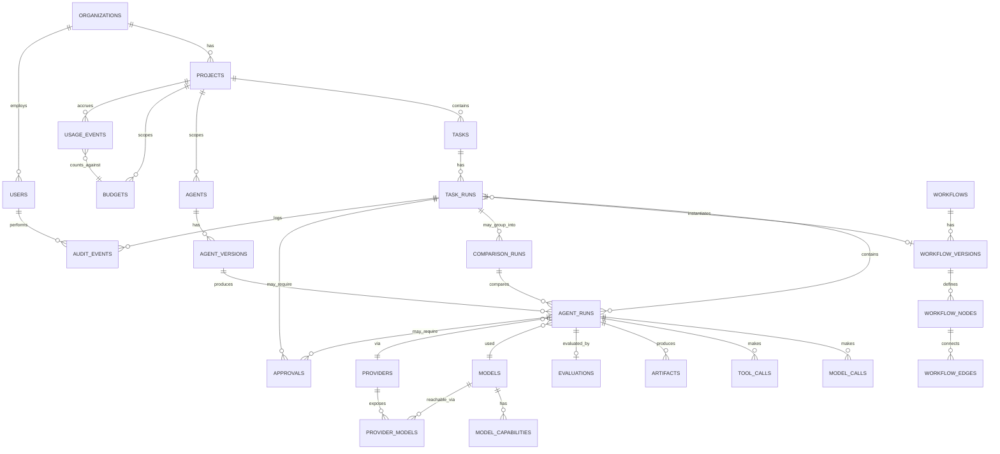

### 24.2 Core Entities and Key Fields

| Entity | Key Fields | Notes |
|---|---|---|
| `users` | id, org_id, email, role | RBAC role at org/project grain. |
| `organizations` | id, name, settings | Tenant root. |
| `projects` | id, org_id, name, policy_settings | Owns Agents, Tasks, Budgets, tool policy defaults. |
| `tasks` | id, project_id, title, description, requirements, execution_mode, created_by, status | Status per Section 26.1. |
| `task_runs` | id, task_id, workflow_version_id (nullable), status, budget_id, started_at, ended_at | One execution attempt of a Task. |
| `agents` | id, project_id, name, role, current_status | Stable identity. |
| `agent_versions` | id, agent_id, version, system_instructions_ref, capabilities, allowed_tools, prohibited_tools, model_policy, budget_policy, timeout, retry_policy, approval_requirements, status | Immutable once published. |
| `agent_runs` | id, task_run_id, agent_version_id, workflow_node_id (nullable), model_id, provider_id, status, started_at, ended_at, sandbox_ref | The execution unit. |
| `models` | id, canonical_model_id, family, context_window, modalities, status | Registry entry. |
| `providers` | id, type (openrouter/direct/local/enterprise), name, health_status | Provider Adapter instance config. |
| `provider_models` | id, model_id, provider_id, pricing, latency, throughput, last_refreshed_at | Join entity: a Model as reachable via a specific Provider. |
| `model_capabilities` | id, model_id, capability_key, value/tier | Normalized capability facts (tool-calling, reasoning tier, coding tier, vision, etc.). |
| `workflows` | id, project_id, name, current_status | Stable identity. |
| `workflow_versions` | id, workflow_id, version, status | Immutable once published. |
| `workflow_nodes` | id, workflow_version_id, node_type, config (agent_id ref / repair bounds / condition expr) | Node definition. |
| `workflow_edges` | id, workflow_version_id, from_node_id, to_node_id, condition | Edge definition. |
| `model_calls` | id, agent_run_id, model_id, provider_id, tokens_in, tokens_out, cost, latency_ms, structured_output_ok, status | Per-inference record. |
| `tool_calls` | id, agent_run_id, tool_id, inputs_ref, outputs_ref, permission_decision, status, latency_ms | Per-tool-invocation record. |
| `artifacts` | id, agent_run_id, type (diff/file/report/log), storage_ref, created_at | Durable outputs. |
| `evaluations` | id, agent_run_id, objective_metrics(json), judge_score(json, nullable), human_decision, human_notes, evaluated_at | Section 17 record. |
| `comparison_runs` | id, task_run_id, candidate_agent_run_ids[], status, winner_agent_run_id (nullable) | Section 18 grouping. |
| `approvals` | id, scope, scope_ref_id, operation_type, policy_rule_id, status, requested_by, resolved_by, resolved_at | Section 23 record. |
| `budgets` | id, scope (execution/task/user/project/day/month), scope_ref_id, limit_amount, currency, thresholds(json) | Section 19. |
| `usage_events` | id, project_id, budget_ids[], source_ref (model_call/tool_call), amount, occurred_at | Rolls up into budget totals. |
| `audit_events` | id, org_id, actor_user_id, event_type, target_ref, occurred_at, detail(json) | Security/compliance log (Section 20.5), distinct from execution Flight Recorder events. |

> **v1.1 note on the table above.** Several fields in 24.2 are superseded by normalized entities introduced in Section 24.4, per the Owner's explicit instruction not to represent relational relationships as arrays/serialized lists even on SQLite. Specifically: `agent_versions.allowed_tools`/`prohibited_tools` (arrays) → `agent_version_tool_grants` join table against a new `tools` entity; `comparison_runs.candidate_agent_run_ids[]` → `comparison_candidates` join table; `agent_versions.system_instructions_ref` → FK to `prompt_versions`; `agent_runs.model_id`/`provider_id` remain as convenience FKs to the live registry but are now accompanied by a FK to an immutable `provider_model_snapshots` row (reproducibility fix); `approvals.context_refs` is joined by an explicit `action_fingerprint`/`bound_artifact_id` (exact-binding fix). The 24.2 table is left in place as the original high-level overview; 24.4 is the authoritative, corrected entity list for anything it modifies.

### 24.3 Lifecycle / Status Field Summary

- `tasks.status`: `draft → ready → archived` (template/lifecycle only, **corrected v1.1** — see Section 26.1/26.7 #20). `task_runs.status`, `agent_runs.status`, `workflow_runs.status`: state machines in Section 26, all now including the `cancelling` intermediate state (Section 26.7).
- `agents.status` / `agent_versions.status` and `workflows.status` / `workflow_versions.status`: `draft → active → deprecated → retired`, independent of any given run's status; the distinct behavior of `deprecated` vs. `retired` is now specified in full in Section 26.7's table (**corrected v1.1**, previously `retired`'s distinct behavior was undefined).
- `approvals.status`: `pending → approved | rejected | expired`, now additionally checked against `action_fingerprint` at resolution and again at execution time (Section 24.4 #15).
- `providers.health_status`: `up | degraded | down`, refreshed by health checks (Section 13.3).
- `job_queue.status` (new, Section 24.4 #12): `pending → leased → done | failed`, governed by the lease/fencing mechanism in Section 26.6.

### 24.4 New / Changed Entities — v1.1 Correction Pass

All entities below are relational tables (via SQLAlchemy models, versioned by Alembic), consistent with Section 10.5's normalization and portability rules. JSON columns are used only for structured snapshots/payloads that are not queried relationally, never as a substitute for a foreign key or join table. Each is tagged with the gap number it resolves (Section 0a).

**1–2. `workflow_runs` / `workflow_node_runs`** (gaps 1, 2) — make Workflow execution state a first-class, queryable history instead of only "persisted somewhere" as 16.5/26.6 described conceptually.

| Entity | Key Fields | Notes |
|---|---|---|
| `workflow_runs` | `id`, `task_run_id` (FK, 1:1 — a Task Run in Mode 4 instantiates exactly one Workflow Run), `workflow_version_id` (FK), `status` (Section 26.4), `started_at`, `ended_at`, `cancellation_requested_at`, `cancellation_requested_by` | One durable execution of a Workflow Version. Replaces the implicit "the engine persists node state somewhere" language in 16.5. |
| `workflow_node_runs` | `id`, `workflow_run_id` (FK), `workflow_node_id` (FK to the node *definition*), `iteration` (int, default 0 — increments for each `repair_loop` cycle through the same node), `status`, `agent_run_id` (FK, nullable — set for `agent`/`parallel_group` nodes), `started_at`, `ended_at`, `output_snapshot_ref`, `lease_owner`, `lease_expires_at`, `heartbeat_at`, `fencing_token` | One execution instance of one DAG node. A `repair_loop` executing 2 iterations produces 2 rows with the same `workflow_node_id`, distinguishing "which attempt" — this is what Section 26.3's "node-level events distinguishable in Activity view" (MA7 acceptance criterion) actually requires structurally. |

**3. `prompt_versions`** (gap 3) — makes Section 12.4's "system_instructions is itself a versioned artifact" literally true rather than a field comment.

| Entity | Key Fields | Notes |
|---|---|---|
| `prompt_versions` | `id`, `agent_id` (FK — prompt versions belong to an Agent's lineage, independent of which Agent Version wraps them), `version`, `content`, `created_at`, `created_by` | `agent_versions.system_instructions_ref` becomes a FK to `prompt_versions.id`. Enables comparison axis 3 (Section 17.3: same task/model/role, different prompt version) without minting a whole new Agent Version for a wording change. |

**4. `execution_events`** (gap 4) — the actual Flight Recorder table, formally distinct from `audit_events`.

| Entity | Key Fields | Notes |
|---|---|---|
| `execution_events` | `id`, `occurred_at`, `task_id`, `task_run_id`, `workflow_run_id` (nullable), `workflow_node_run_id` (nullable), `agent_run_id` (nullable), `agent_id`, `agent_version_id`, `model_id` (nullable), `provider_id` (nullable), `prompt_version_id` (nullable), `event_type`, `tool_call_id` (nullable FK), `artifact_refs` (JSON list of artifact IDs — an array of *references*, not a relational relationship, so JSON is appropriate here per Section 10.5.5), `tokens_in`, `tokens_out`, `cost`, `latency_ms`, `decision_summary`, `error` (JSON), `actor_user_id` (nullable) | This is the Section 22.2 schema, now with a named table. `audit_events` (Section 20.5) remains a separate table for security/compliance-relevant events only (approvals resolved, secret access/rotation, RBAC changes, tool-permission grants) — the two tables have different retention/query audiences and are never merged, resolving the ambiguity in the v1.0 text ("`audit_events`/execution-event tables," which read as possibly one thing). |

**5. `tools` + `agent_version_tool_grants`** (gap 5) — stable tool identity, normalized grants.

| Entity | Key Fields | Notes |
|---|---|---|
| `tools` | `id` (stable slug, e.g. `repo.read`, `git.commit`, `terminal.test`), `name`, `category` (Section 15.2), `description`, `input_schema_ref`, `tool_version`, `status` (`active`/`deprecated`), `created_at` | Every tool referenced anywhere (Tool Bus checks, `tool_calls.tool_id`, Agent Version grants) points at a stable row here, satisfying "stable Tool definitions/IDs." |
| `agent_version_tool_grants` | `id`, `agent_version_id` (FK), `tool_id` (FK), `grant_type` (`allow`/`deny`), `created_at` | Replaces `agent_versions.allowed_tools`/`prohibited_tools` arrays. Tool Bus permission check (15.3) becomes a join/query instead of array-membership logic; deny still always wins over allow per existing policy. |

**6. `project_memberships`** (gap 6) — project-level RBAC, matching Section 20.4's stated model.

| Entity | Key Fields | Notes |
|---|---|---|
| `project_memberships` | `id`, `project_id` (FK), `user_id` (FK), `role` (`owner`/`admin`/`member`/`viewer`), `granted_at`, `granted_by` | The v1.0 `users` table only carried an org-level `role`, contradicting 20.4's "project-level roles: Owner, Admin, Member, Viewer." This table is required even for a single-user V1 deployment (Appendix D asks whether V1 is single-user) so the RBAC model doesn't need retrofitting later. |

**7. `comparison_candidates`** (gap 7) — normalized comparison membership.

| Entity | Key Fields | Notes |
|---|---|---|
| `comparison_candidates` | `id`, `comparison_run_id` (FK), `agent_run_id` (FK), `label` (e.g. "Candidate A"), `rank` (nullable, filled post-evaluation), `is_winner` (bool, default false) | Replaces `comparison_runs.candidate_agent_run_ids[]`. `comparison_runs.winner_agent_run_id` may remain as a denormalized convenience FK but must always agree with the row where `is_winner = true`; a DB constraint or application invariant enforces this rather than letting the two disagree. |

**8. `provider_model_snapshots`** (gap 8) — historical Model/Provider binding correctness.

| Entity | Key Fields | Notes |
|---|---|---|
| `provider_model_snapshots` | `id`, `provider_model_id` (FK to the live `provider_models` row at time of snapshot), `model_id`, `provider_id`, `pricing_input_per_mtok`, `pricing_output_per_mtok`, `context_window`, `capability_snapshot` (JSON — a copy of the relevant `model_capabilities` rows at snapshot time), `snapshotted_at` | **This closes a real reproducibility gap in v1.0**: `agent_runs.model_id`/`provider_id` pointed at live registry rows whose pricing/capability fields are *mutated in place* on every catalog refresh (Section 13.3). Two runs against "the same model_id" six months apart could silently have different recorded pricing/capability context with no way to tell which applied at run time. `agent_runs` now also carries `provider_model_snapshot_id` (FK, immutable once set), created at Model Router resolution time (Section 14.5's `RESOLVE` step), so NFR "Reproducibility" holds for model metadata, not just model identity. |

**9. Task Run configuration snapshot** (gap 9) — no new table; a column addition.

| Entity | Key Fields | Notes |
|---|---|---|
| `task_runs` (+column) | `config_snapshot` (JSON) | Captures the Task's requirements, execution mode, agent/model selection, tool grants, budget refs, and approval rules **as they were at the moment this Task Run started**, independent of later edits to the parent `tasks` row. JSON is appropriate here (Section 10.5.5) because it's a point-in-time denormalized copy, not something queried relationally — anything inside it that *does* need relational querying (e.g., which budget applied) is also captured via a normal FK alongside it, not only inside the JSON. |

**10. `agent_run_attempts`** (gap 10) — durable retry/attempt semantics.

| Entity | Key Fields | Notes |
|---|---|---|
| `agent_run_attempts` | `id`, `agent_run_id` (FK), `attempt_number`, `started_at`, `ended_at`, `status`, `error` (JSON, nullable), `worker_id` | The v1.0 state machine (26.3) showed `FAILED --> RUNNING: retry` on `agent_runs` itself with no durable per-attempt record, which would collapse cost/evaluation accounting for a run that failed-then-succeeded on attempt 2 into one ambiguous row. `agent_runs` remains the logical unit; each retry is a row here, and `model_calls`/`tool_calls` gain a nullable `agent_run_attempt_id` FK so cost/telemetry can be sliced per attempt when needed. |

**11. `idempotency_keys`** (gap 11) — generalizes Section 28.3 and 25.4 into one durable mechanism.

| Entity | Key Fields | Notes |
|---|---|---|
| `idempotency_keys` | `id`, `key` (unique, indexed), `scope` (`api_request` \| `tool_call`), `resource_type`, `resource_id` (nullable until the operation completes), `result_ref` (JSON, nullable), `status` (`in_progress`/`completed`/`failed`), `created_at` | Both the API layer's `Idempotency-Key` header handling (25.4) and the Tool Bus's side-effecting-tool dedup (28.3, e.g. git commit/PR-create) write through this single table instead of two ad hoc mechanisms, so "has this exact operation already happened" is answerable one way, consistently. |

**12. Lease / heartbeat / fencing columns** (gap 12) — worker-crash recovery, generalized beyond just Agent Runs.

| Entity | Key Fields | Notes |
|---|---|---|
| `job_queue` (new) | `id`, `job_type` (`agent_run`/`workflow_node`/`evaluation`/…), `payload_ref`, `status` (`pending`/`leased`/`done`/`failed`), `lease_owner`, `lease_expires_at`, `heartbeat_at`, `fencing_token`, `created_at` | The durable job table referenced in Section 10.5.3. A worker claims a row in one short transaction (setting `lease_owner`, `lease_expires_at`, incrementing `fencing_token`), does the work with no open transaction, then writes completion in a second short transaction. If a worker's lease expires (crash/hang), another worker may re-claim the row with a *new*, higher `fencing_token`; any write attempted by the original (zombie) worker using its old `fencing_token` is rejected at commit time — this is the fencing mechanism, and it's what makes "resume, never duplicate" (FR15, Acceptance Criterion 9) actually enforceable rather than best-effort. `agent_runs` and `workflow_node_runs` (above) carry the same four columns for the same reason at their own granularity. |

**13. `budget_reservations`** (gap 13) — correctness under concurrent/parallel execution.

| Entity | Key Fields | Notes |
|---|---|---|
| `budget_reservations` | `id`, `budget_id` (FK), `agent_run_id` (FK, nullable), `task_run_id` (FK, nullable), `reserved_amount`, `status` (`active`/`committed`/`released`), `created_at`, `expires_at` | **This closes a real correctness gap**: v1.0's `usage_events` only recorded *actual* spend after a Model Call completed. In Mode 3 (Parallel Comparison), N candidates could each check "are we under budget?" against the same stale total before any of them had recorded usage, and all proceed — a classic check-then-act race, worse under SQLite's single-writer model if not designed for. V1.1 requires the Cost/Budget Governor to create a `budget_reservations` row (one short transaction) for the *estimated* cost of a Model Call/Agent Run *before* dispatch; on completion, actual usage is recorded and the reservation is committed (adjusted to actual) or released. Budget-threshold checks (Section 19.3) are evaluated against **reserved + actual**, not actual alone. |

**14. `router_policy_versions` + `model_routing_decisions`** (gap 14) — routing reproducibility.

| Entity | Key Fields | Notes |
|---|---|---|
| `router_policy_versions` | `id`, `version`, `scoring_config` (JSON — weights/thresholds for Section 14.3's scoring function), `status` (`active`/`deprecated`), `created_at` | Versions the Auto-routing scoring policy itself, so "why did Auto pick this model" stays answerable even after the scoring function's weights change (relevant especially once MA8 starts tuning it). |
| `model_routing_decisions` | `id`, `agent_run_id` (FK), `router_policy_version_id` (FK), `selection_mode` (`manual`/`auto`), `eligible_candidates` (JSON snapshot of the ranked candidate set — a point-in-time list, not a relational membership, so JSON is correct here), `selected_provider_model_snapshot_id` (FK to entity 8), `rationale`, `created_at` | Gives Section 14.5's "Flight Recorder: candidate set + rationale + choice" step an actual table instead of only an `execution_events` row, so routing history can be queried/aggregated directly (needed by MA8's "auto-routed selections measurably correlate with better outcomes" acceptance criterion). |

**15. Exact approval binding** (gap 15) — `approvals` column additions.

| Entity | Key Fields | Notes |
|---|---|---|
| `approvals` (+columns) | `action_fingerprint` (sha256 of the exact payload being approved — e.g., diff content + target branch + head commit SHA for a PR merge, or migration SQL text for a DB migration), `bound_artifact_id` (FK to `artifacts`, nullable) | **Closes a real gap**: v1.0's `context_refs` ("links to the diff/PR/migration/etc.") is a pointer, not a binding — if the underlying PR gained new commits between approval and merge, the v1.0 model had no structural way to say "this approval no longer matches what's about to happen." v1.1 requires the gated transition's execution code to recompute the current action's fingerprint and reject the transition (re-requiring approval) if it doesn't match `approvals.action_fingerprint` exactly. This directly serves NG5/reproducibility and closes a TOCTOU-style approval-bypass risk. |

**16. Cancellation propagation** (gap 16) — columns + rule, detailed fully in Section 26.7.

| Entity | Key Fields | Notes |
|---|---|---|
| `task_runs` / `workflow_runs` / `agent_runs` (+columns, each) | `cancellation_requested_at`, `cancellation_requested_by` | A cancellation request is recorded immediately (short transaction) even though the underlying work stops cooperatively at the next checkpoint (Section 28.4), not instantly — see the new `CANCELLING` state in Section 26.7. |

**17. `source_snapshots`** (gap 17) — repo/base-commit anchoring for coding tasks.

| Entity | Key Fields | Notes |
|---|---|---|
| `source_snapshots` | `id`, `task_run_id` (FK), `repo_url_or_path`, `base_ref`, `base_commit_sha`, `working_branch_name` (nullable), `captured_at` | Anchors exactly what "the repository" meant for a given Task Run, at the exact commit — required for both Sandbox worktree creation (21.2) and for reproducibility (a diff/patch artifact is meaningless without knowing its base). |

**18. Artifact identity** (gap 18) — `artifacts` column additions.

| Entity | Key Fields | Notes |
|---|---|---|
| `artifacts` (+columns) | `content_hash` (sha256), `size_bytes`, `mime_type` | Enables integrity verification, dedup, and is also what `approvals.action_fingerprint` (gap 15) can be computed from/checked against when the approved action is "accept this artifact." |

**19. `secret_references`** (gap 19) — secret values never in ordinary domain tables.

| Entity | Key Fields | Notes |
|---|---|---|
| `secret_references` | `id`, `project_id` (FK), `provider_id` (FK, nullable), `name`, `secret_store_ref` (opaque pointer into the actual local secret store — Section 10.5/Appendix D), `created_at`, `rotated_at`, `created_by` | `providers.credential_ref` (and any future integration needing a secret) points here, never to a plaintext column. What backs `secret_store_ref` (OS keychain vs. encrypted local vault file) is a new Owner Decision (Appendix D) — the *pattern* (reference, not value, in domain tables) is frozen regardless of which backing store is chosen. |

**20. Task vs. Task Run / Agent Version lifecycle** (gap 20) — resolved in Section 26.7, not a new table.

---

## 25. API Contracts

### 25.1 Design Principles

REST for resource CRUD and command endpoints; SSE (V1 default, simpler than WebSocket for mostly-server-to-client status streaming) or WebSocket (if bidirectional low-latency control, e.g., live "stop" acknowledgment, proves necessary) for live execution status. All endpoints require authentication; all mutating endpoints enforce RBAC + project scoping (Section 20.4). All responses include enough versioned-reference data (agent_version_id, model_id, provider_id, workflow_version_id) to satisfy reproducibility (NFR).

### 25.2 Major Resource Boundaries

| Boundary | Key Endpoints (illustrative, not exhaustive) |
|---|---|
| `/agents` | `GET/POST /agents`, `GET /agents/{id}`, `POST /agents/{id}/versions`, `POST /agents/{id}/versions/{v}/publish`, `GET /agents/{id}/versions` |
| `/models` | `GET /models` (registry list, filterable by capability), `GET /models/{id}`, `POST /models/refresh`, `GET /providers`, `POST /providers` |
| `/tasks` | `POST /tasks`, `GET /tasks/{id}`, `POST /tasks/{id}/runs` (start a run), `GET /tasks/{id}/runs`, `POST /tasks/{id}/runs/{run_id}/cancel` |
| `/tasks/{id}/runs/{run_id}` | `GET` (status + summary), `GET /events` (Flight Recorder slice), `POST /approve-continue` (budget/approval unblock where applicable) |
| `/agent-runs/{id}` | `GET` (status/detail), `POST /stop`, `POST /retry`, `GET /events`, `GET /artifacts` |
| `/workflows` | `GET/POST /workflows`, `POST /workflows/{id}/versions`, `POST /workflows/{id}/versions/{v}/publish`, `GET /workflows/{id}/versions/{v}/graph` |
| `/comparisons` | `POST /comparisons` (create from N agent_run_ids or trigger Mode 3), `GET /comparisons/{id}`, `POST /comparisons/{id}/select-winner` |
| `/evaluations` | `GET /evaluations?agent_id=&model_id=&task_type=` (comparison queries per Section 17.3 axes), `GET /evaluations/{id}` |
| `/approvals` | `GET /approvals?status=pending`, `POST /approvals/{id}/resolve` |
| `/usage`, `/costs` | `GET /usage?scope=project&range=`, `GET /costs/budgets`, `POST /budgets`, `PATCH /budgets/{id}` |
| `/events` | `GET /events?task_run_id=` (global Flight Recorder query endpoint), `GET /events/stream` (SSE) |

### 25.3 Live Execution Stream

`GET /tasks/{id}/runs/{run_id}/stream` (SSE) emits Flight Recorder events as they occur for that Task Run, scoped by the requester's project access, powering the running-task screen (Section 27.4). Reconnection resumes from `last_event_id` (standard SSE resume semantics) so a brief client disconnect doesn't lose status continuity — this also reuses the same durability the Flight Recorder already provides for resumability (Section 16.5), rather than requiring a separate "live state" cache.

### 25.4 Idempotency

State-changing POSTs that might be retried by the client (start run, resolve approval) accept an `Idempotency-Key` header; the API layer deduplicates on this key against recently-processed requests to avoid double-starting a run or double-resolving an approval on client retry (complementing Section 28's execution-level idempotency for tool calls).

### 25.5 API Contract Changes — v1.1 Correction Pass

These follow directly from Section 24.4's new entities; no new product-level endpoints are introduced, only additions/corrections to existing ones so the API surface matches the corrected data model.

- **`/workflows/{id}/versions/{v}/runs`** (new boundary) — `GET /workflows/{id}/versions/{v}/runs` and `GET /workflow-runs/{id}` / `GET /workflow-runs/{id}/nodes` expose `workflow_runs`/`workflow_node_runs` (24.4 #1–2) directly, rather than only inferring workflow execution state from Task Run status as v1.0 implied. `GET /workflow-runs/{id}/nodes/{node_id}/attempts` exposes per-iteration `workflow_node_runs` rows for a repair-loop node.
- **`/agents/{id}/prompt-versions`** (new boundary) — `GET/POST /agents/{id}/prompt-versions` manages `prompt_versions` (24.4 #3) independently of `POST /agents/{id}/versions`, enabling a prompt-only iteration without minting a new Agent Version, per Section 12.4's intent.
- **`GET /tasks/{id}/runs/{run_id}/events`** now explicitly documented as querying `execution_events` (24.4 #4); a **separate**, RBAC-restricted `GET /audit-events` endpoint (Admin/Owner only) is added for the security/compliance log, so the two are never conflated at the API layer either, matching Section 20.5.
- **`/tools`** (new boundary) — `GET /tools` lists the stable `tools` registry (24.4 #5); `POST/DELETE /agents/{id}/versions/{v}/tool-grants` replaces any prior implicit "edit the `allowed_tools` array" pattern with explicit grant/revoke operations against `agent_version_tool_grants`.
- **`/projects/{id}/members`** (new boundary) — `GET/POST/PATCH/DELETE /projects/{id}/members` manages `project_memberships` (24.4 #6), needed even for a single-user V1 per the RBAC model in 20.4.
- **`POST /comparisons`** request/response updated: accepts/returns a list of `{agent_run_id, label}` candidate objects backed by `comparison_candidates` (24.4 #7) instead of a bare `agent_run_ids` array; `POST /comparisons/{id}/select-winner` sets `is_winner` on the corresponding row (and syncs the denormalized `winner_agent_run_id`).
- **`GET /agent-runs/{id}`** response now includes `provider_model_snapshot` (24.4 #8) inline (pricing/capability/context as they were *at run time*), not just `model_id`/`provider_id`, so a client rendering historical cost/capability context never has to separately query the (possibly since-changed) live registry.
- **`GET /tasks/{id}/runs/{run_id}`** response includes `config_snapshot` (24.4 #9) so a client can render "what this run was actually configured with" even if the parent Task has since been edited.
- **`GET /agent-runs/{id}/attempts`** (new) — exposes `agent_run_attempts` (24.4 #10) for retry-history display.
- **All state-changing POSTs** that Section 25.4 already required an `Idempotency-Key` for now explicitly resolve against the single `idempotency_keys` table (24.4 #11), documented once rather than described ad hoc per endpoint.
- **`POST /agent-runs/{id}/stop`** and **`POST /tasks/{id}/runs/{run_id}/cancel`** are documented as setting `cancellation_requested_at`/`by` (24.4 #16) and returning immediately with the new `CANCELLING` status (Section 26.7) rather than implying synchronous, instant cancellation.
- **`GET /router/simulate`** (Section 27.7's dry-run, formalized as an endpoint) returns the `router_policy_version_id` and the `eligible_candidates` snapshot it would record (24.4 #14), so the "what would Auto pick and why" preview is provably the same data path as a real routing decision, not a separate ad hoc computation.
- **`POST /approvals/{id}/resolve`** request now requires the caller (approver UI) to echo the `action_fingerprint` it displayed; the server rejects the resolution with a `409 fingerprint_mismatch` if the underlying action changed since the Approval was created (24.4 #15), and the gated transition itself re-checks the fingerprint again at execution time as a second, server-side-only check.

---

## 26. State Machines

### 26.1 Task State Machine (Corrected v1.1 — see Section 26.7 #20 for rationale)

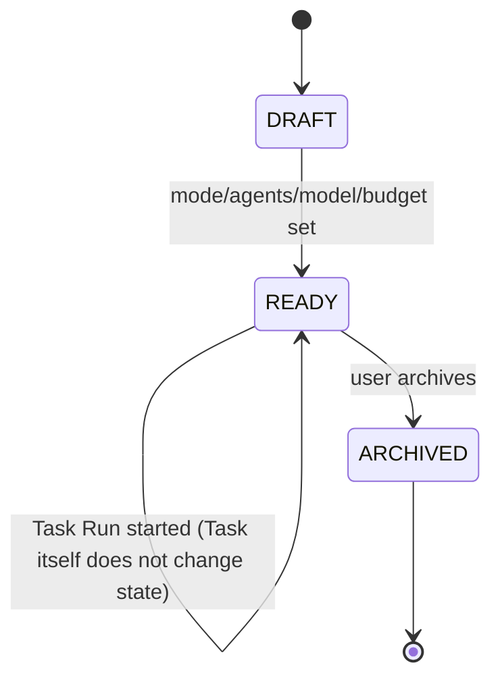

A `Task` is the durable, reusable **template/definition** object — its own status (`draft`/`ready`/`archived`) reflects only whether it's editable-and-incomplete, ready to run, or retired from active use. It is **not** where execution state lives. A Task can be run any number of times, including concurrently, each producing an independent `Task Run` (26.2); **all** execution status (queued/running/completed/failed/cancelled) lives exclusively on the Task Run. This replaces the v1.0 diagram, whose `Task` state machine duplicated `RUNNING`/`COMPLETED`/`FAILED`/`CANCELLED` from Task Run and modeled "retry" as the *Task* moving back to `QUEUED` — which both contradicted "a Task can have multiple Task Runs" (Section 5 Terminology) and left undefined what a second, concurrently-started Task Run would do to a Task's single status field. See Section 26.7 for the full resolution.

### 26.2 Task Run State Machine

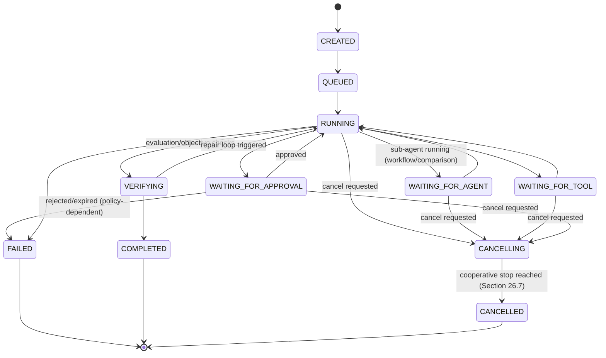

*(v1.1: `CANCELLING` added — see Section 26.7 #16 for the propagation rule this implements.)*

### 26.3 Agent Run State Machine

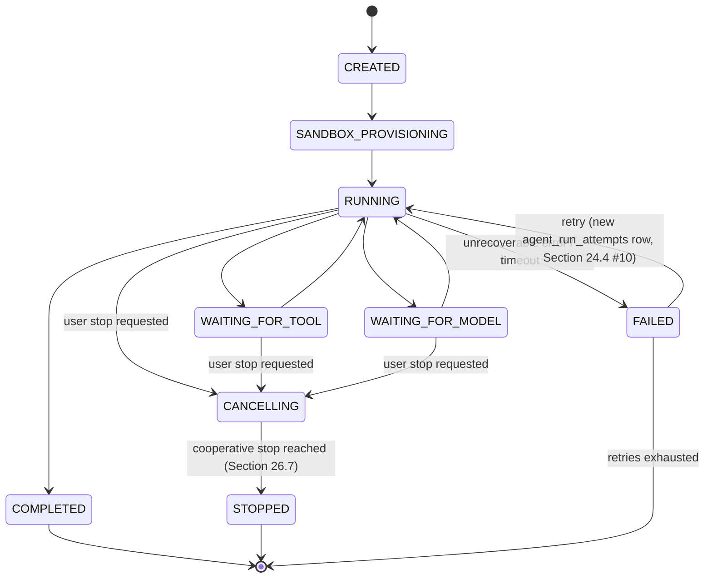

*(v1.1: `CANCELLING` added, and each retry now durably recorded as a distinct `agent_run_attempts` row rather than an implicit re-entry into `RUNNING` — Section 24.4 #10, #12.)*

### 26.4 Workflow Run State Machine

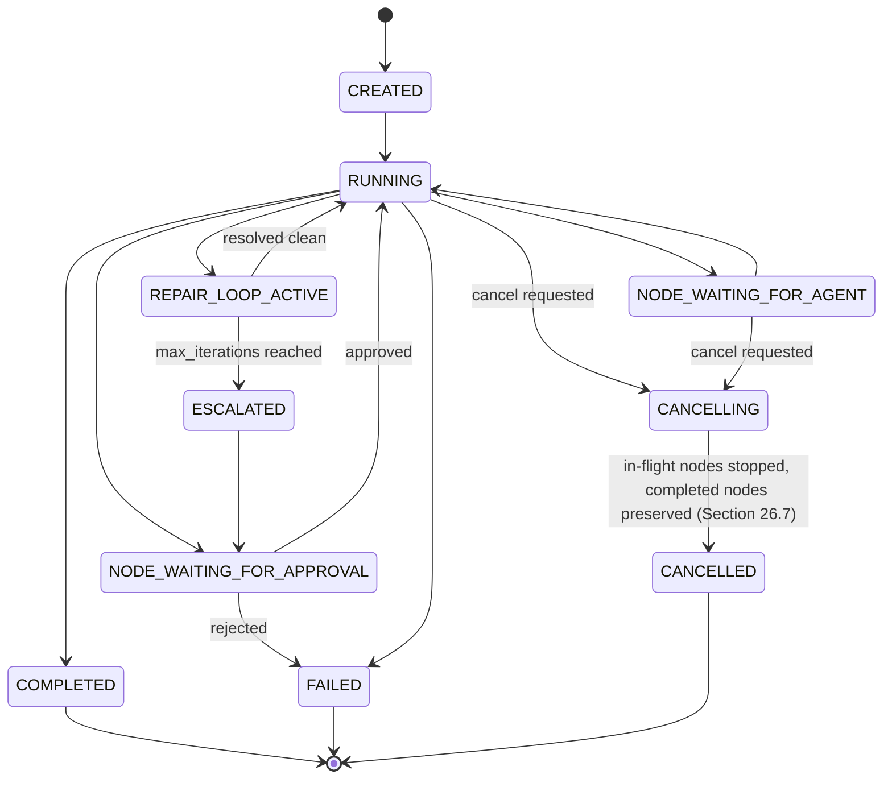

*(v1.1: `CANCELLING` added — cancelling a Workflow Run stops in-flight/pending node runs but never retroactively invalidates already-completed `workflow_node_runs`, Section 26.7 #16.)*

### 26.5 Approval State Machine

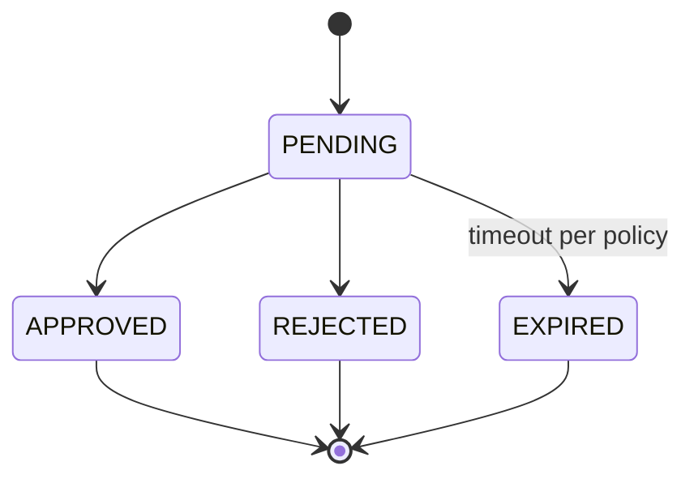

### 26.6 Resumability Contract

Every non-terminal state above is durably persisted (not held only in worker memory) before the corresponding job is dispatched, so that a worker crash mid-`RUNNING` resumes from the last durably-recorded state (re-attaching to or re-issuing the specific pending step) rather than restarting the whole run — this is the concrete mechanism behind FR15 and the "resumable workflows" NFR.

**v1.1 addition:** resumption is now specifically defined in terms of the `job_queue` lease/fencing mechanism (Section 24.4 #12): a resumed run is one whose `job_queue` row's lease expired without a completion write; a new worker re-claims it with a fresh `fencing_token`, and any late write from the original worker (using the stale token) is rejected. This makes "resumes correctly, never duplicates a side effect" (Acceptance Criterion 9) a property the database enforces, not only a property the worker code is trusted to uphold.

### 26.7 State Machine Corrections — v1.1 Correction Pass

**Cancellation propagation (gap 16).** v1.0 showed `CANCELLED` as a direct target of a `RUNNING --> CANCELLED` edge at every level (Task Run, Agent Run, Workflow Run), implying instantaneous cancellation. This is corrected: cancellation is **cooperative**, not preemptive, except for sandbox teardown (which is forced immediately once cancellation is acknowledged, per Section 21.2's cleanup rule). The rule, applied uniformly:

1. A cancel request writes `cancellation_requested_at`/`cancellation_requested_by` (Section 24.4 #16) in one short transaction and the entity moves to `CANCELLING` immediately (visible to the UI right away — this satisfies the "~1s status update" NFR even though the underlying work hasn't stopped yet).
2. The running worker checks for a pending cancellation at each checkpoint boundary (Section 28.4: after each Tool Call, Model Call, or Workflow node completes) and, on seeing one, stops advancing, tears down its sandbox, preserves whatever Artifacts/Evaluation data already exist, and transitions to the terminal `CANCELLED`/`STOPPED` state.
3. **Propagation is downward and non-retroactive:** cancelling a Task Run propagates a cancellation request to its Workflow Run (if any) and to all *non-terminal* Agent Runs under it; cancelling a Workflow Run propagates to its in-flight/pending `workflow_node_runs` only. Already-`COMPLETED` Agent Runs or node runs are never retroactively marked cancelled, and their Artifacts/Evaluation records remain valid and usable (consistent with 28.1's "partial completion is always representable" rule).
4. A cancellation request against an already-terminal entity is a no-op, recorded but without a state change.

**Task vs. Task Run status overlap (gap 20, part 1).** Resolved by the corrected Section 26.1: `Task.status` is now `draft | ready | archived` only (a template/lifecycle status), and all execution status (`queued/running/waiting_for_*/verifying/completed/failed/cancelling/cancelled`) lives exclusively on `Task Run`. A Task may have any number of Task Runs, including concurrently-running ones — this was already implied by Section 5's Terminology and Section 18.1 (comparisons group multiple runs of one Task) but was structurally contradicted by v1.0's Task state machine, which is now fixed.

**Agent Version `deprecated` vs. `retired` (gap 20, part 2).** v1.0 defined the enum (`draft/active/deprecated/retired`) and stated "only active versions are selectable for new runs," and separately that deprecating "hides from pickers but does not affect historical runs or block explicit re-selection by id for reruns" — leaving `retired`'s distinct behavior undefined. Resolved:

| Status | Selectable from picker (new Task) | Explicitly re-selectable by id (rerun) | Existing Agent Runs referencing it |
|---|---|---|---|
| `draft` | No (not yet published) | No | N/A (no runs reference a draft version) |
| `active` | Yes | Yes | Unaffected |
| `deprecated` | No | **Yes** — a user who explicitly knows the version id (e.g., rerunning a historical Task Run) may still select it | Unaffected |
| `retired` | No | **No** — blocked even by explicit id selection; only reachable for read/audit purposes | Unaffected (retirement never rewrites history) |

The same table applies to `Workflow` / `Workflow Version` status, by the same reasoning (16.4's immutability principle). Note that in no case does changing an Agent Version's or Workflow Version's status alter any existing `agent_runs`/`workflow_runs` row — this is what keeps NG5's reproducibility guarantee intact across the full lifecycle, not just while a version is `active`.

---

## 27. UI/UX Specification

### 27.1 Primary Navigation

Dashboard · Tasks · Agents · Workflows · Models · Model Router · Comparisons · Evaluations · Approvals · Costs · Activity (Flight Recorder) · Settings.

### 27.2 Dashboard

At-a-glance: active Task Runs, pending Approvals, budget status (per project, current day/month), recent Evaluation highlights (e.g., "Backend Engineer: Claude vs. DeepSeek, last 20 runs"), recent failures/errors needing attention.

### 27.3 Task Creation Flow

```mermaid
flowchart TD
    C[Create Task] --> MODE[Choose Execution Mode:\nSingle Agent / Build+Review / Parallel Comparison / Multi-Agent Workflow]
    MODE --> SCOPE[Select project/workspace]
    SCOPE --> AGENTSEL[Select Agent(s) — or Workflow, for Mode 4]
    AGENTSEL --> MODELSEL[Model selection: Auto or Manual]
    MODELSEL --> TOOLS[Select/confirm allowed tools\n(bounded by Agent's allow-list)]
    TOOLS --> BUDGET[Set budget]
    BUDGET --> LIMITS[Set execution limits:\ntimeout, max repair iterations, max retries]
    LIMITS --> APPROVALRULES[Confirm/override approval rules]
    APPROVALRULES --> SUBMIT[Submit — Task Run starts]
```

### 27.4 Running Task Screen

Live agent status list (per the brief's example format):

```
Planner        COMPLETE
Architect      COMPLETE
Coder A        RUNNING
Coder B        RUNNING
Tester         WAITING
Reviewer       WAITING
```

Alongside: running cost total, token usage, elapsed runtime, live tool-activity feed, artifacts produced so far, errors/warnings, and any pending Approval prompts — all fed by the SSE stream (Section 25.3), so the screen is a live projection of Flight Recorder events, not a separately-maintained UI state.

### 27.5 Mode-Specific Views

- **Build + Review:** side-by-side Agent A deliverable / Agent B findings, with explicit action buttons: Accept, Reject, Send back to Agent A, Reassign to another Agent, Request another review, Enable/disable auto-repair-loop.
- **Parallel Comparison:** candidate columns (one per Agent/Model), each showing its own status independently until all complete (no partial peeking that would undermine isolation optics even if backend isolation is already guaranteed), then the objective comparison table + optional Judge scores + winner selection control.
- **Multi-Agent Workflow:** DAG visualization with live node status coloring (pending/running/waiting-approval/complete/failed), click-through to any node's Agent Run detail.

### 27.6 Agents / Models / Workflows Management Views

Standard registry CRUD UIs: list, create, version history/diff, publish/deprecate, and — for Agents and Models specifically — an embedded Evaluation summary panel ("this Agent's empirical performance across models used").

### 27.7 Model Router View

Shows the current eligible-model set for a given requirement profile, lets a user simulate "what would Auto pick and why" without spending money (a dry-run scoring preview), and shows historical routing decisions with their recorded rationale.

### 27.8 Evaluations / Comparisons Views

Filterable tables/charts over Evaluation records along the four comparison axes (Section 17.3); every chart states its sample size and date range, and explicitly renders "insufficient data" rather than a misleading small-sample ranking (Section 17.4).

### 27.9 Approvals View

Queue of pending approvals scoped to the user's role, with full context (diff/PR link, budget detail, migration plan, etc.) inline so an approver doesn't have to context-switch elsewhere to decide.

### 27.10 Costs View

Budget burn-down per scope, historical spend by project/agent/model, and the graduated-policy status (Section 19.3) currently in effect for each active scope.

### 27.11 Activity / Flight Recorder View

Chronological, filterable (by task/agent/model/event type/date) event stream; the canonical place to answer "what exactly happened here."

---

## 28. Failure Handling

### 28.1 Failure Classes and V1 Response

| Failure Class | Response |
|---|---|
| **Model/provider transient error** (5xx, timeout) | Retry with exponential backoff per Agent Version's `retry_policy`; after max retries, attempt configured fallback model/provider if one is set; else mark Agent Run `FAILED` with structured error. |
| **Provider outage** (health check `down`) | Model Router excludes that provider's models from Auto-selection eligibility; Manual selection shows a clear "provider degraded/down" warning but does not silently block user choice. |
| **Rate limit** | Backoff with jitter; if sustained, surface as a degraded-provider signal to the Router (Section 13.4 reliability score) rather than only failing the single call. |
| **Malformed structured output** | One automatic re-prompt/repair attempt (schema-constrained retry) per call; repeated failure marks the Model Call failed and surfaces to the Agent Run as a tool-equivalent error the agent (or its retry policy) must handle. |
| **Tool failure** | Recorded with full detail on the Tool Call record; Agent Run's retry_policy determines whether the step is retried; tool failures never silently downgrade to "success." |
| **Timeout** (Agent Run or node) | Agent Run/node transitions to `FAILED` (or `ESCALATED` inside a repair loop, Section 26.4); partial artifacts already produced are preserved, not discarded. |
| **Context overflow** | Context Policy's truncation/summarization strategy (Section 12.2) applies first; if still over limit, the Model Call fails explicitly rather than silently dropping content the agent isn't aware is missing. |
| **Agent crash** (worker process failure) | Resumed from last durable checkpoint by another worker (Section 26.6); never silently lost. |
| **Workflow crash** | Workflow Engine resumes the Workflow Run from persisted node-completion state (Section 16.5). |
| **Partial completion** | Always representable as a valid state (`FAILED` or `CANCELLED` with whatever Artifacts/Evaluation data exists so far retained) — partial work is visible and usable by a human, never silently erased. |

### 28.2 Fallback Model/Provider Chains

An Agent Version's `model_policy` (or Task override) may declare an ordered fallback list (e.g., primary → secondary model if primary provider is down). Fallback usage is always recorded as a distinct Flight Recorder event (`fallback_triggered`) with the reason, so cost/evaluation analysis can distinguish "ran on the intended model" from "ran on a fallback."

### 28.3 Idempotency for Side-Effecting Tools

Tool Calls with external side effects (git commit, PR creation) carry an idempotency key derived from the Agent Run + step; a retried step checks for a prior successful call with the same key before re-executing, preventing duplicate commits/PRs on retry-after-partial-failure.

### 28.4 Checkpointing

Checkpoints are written at: Agent Run state transitions (Section 26.3), each completed Tool Call, each completed Model Call, and each completed Workflow node. This granularity bounds the maximum re-do work after a crash to "less than one tool/model call," not "the whole Agent Run."

---

## 29. Testing Strategy

| Test Layer | Focus |
|---|---|
| **Unit tests** | Domain logic: state machine transition validity, budget threshold math, tool permission evaluation, DAG validator (rejecting unbounded repair loops / illegal cycles at publish time, Section 16.3). |
| **Integration tests** | Provider Adapter contract tests (every adapter, including a mock adapter for CI, must satisfy the same interface test suite — this is what keeps G4's provider-independence real, not aspirational); Tool Bus permission enforcement against real allow/deny configurations; Approval gate blocking/unblocking. |
| **Isolation invariant tests** | Automated assertion that, for a Parallel Comparison Run, each candidate's constructed initial Model Call context contains zero tokens/references derived from any sibling candidate's execution — run on every build, not just manually spot-checked (directly verifies G3/Section 21). |
| **Boundedness invariant tests** | Attempt to publish a Workflow Version with a `repair_loop` node missing `max_iterations`, or with an illegal cycle, and assert publish is rejected (verifies Section 16.3). |
| **Resumability tests** | Kill a worker mid-Agent-Run/mid-Workflow-Run in a test harness and assert the run resumes correctly without duplicate side effects (verifies Section 26.6/28.3). |
| **Security tests** | Static/CI check that no provider-credential pattern appears in any frontend bundle (verifies Section 20.1); RBAC/tenant-isolation tests attempting cross-project access by id-guessing. |
| **Evaluation correctness tests** | Given known test/lint/build outcomes, assert the Evaluation record's objective_metrics match exactly (no evaluation-layer miscounting of pass/fail). |
| **End-to-end tests (per mode)** | One golden-path E2E test per execution mode (Sections 7.1–7.4) against a mock Provider Adapter and a fixture repository, asserting the full Task Run reaches `COMPLETED` with expected Artifacts/Evaluation present. |
| **Load/soak (later)** | Concurrency of many simultaneous Parallel Comparison Runs to confirm sandbox isolation and cost accounting hold under load — scheduled for MA9/MA10, not required for V1 sign-off. |
| **SQLite concurrency tests (new v1.1)** | Assert WAL mode and `PRAGMA foreign_keys=ON` are set on every connection; assert no transaction remains open across a simulated long-running model/tool call (a lint-style test around the repository layer, not just manual review); assert concurrent readers are never blocked by an in-progress writer transaction in a test harness that holds a write transaction open briefly on purpose. Required from MA3 onward (first real concurrent writes). |
| **Fencing/lease tests (new v1.1)** | Simulate a worker whose lease expires mid-job, have a second worker re-claim the same `job_queue` row with a new `fencing_token`, then attempt a late write from the first (zombie) worker using its stale token, and assert that write is rejected — the concrete mechanism behind Acceptance Criterion 9. Required from MA3 onward. |
| **Budget reservation race test (new v1.1)** | Dispatch N concurrent Agent Runs against a budget sized to afford fewer than N, and assert the `budget_reservations` mechanism (Section 24.4 #13) blocks/queues the excess rather than allowing all N to proceed on stale "actual usage" totals. Required from MA5 (Parallel Comparison) onward. |
| **Approval fingerprint test (new v1.1)** | Approve an action, then mutate the underlying artifact/diff before the gated transition executes, and assert the transition is rejected with `fingerprint_mismatch` (Section 24.4 #15) rather than proceeding on a stale approval. Required from MA4 (first Approval-gated action) onward. |

---

## 30. V1 Scope

V1's purpose is to **prove the agent/model separation and manual-orchestration thesis with real usage and real evaluation data**, as cheaply and quickly as possible — not to pre-build infrastructure for scale or automation we haven't earned the need for yet.

### 30.1 V1 Capability Checklist (Maps Directly to the Brief's Section 20)

1. Configure multiple Agents (Agent Registry, versioned) — **Section 12**.
2. Connect multiple models through OpenRouter (OpenRouterAdapter, Model Registry) — **Section 13**.
3. Create a Task (all four modes selectable, but see 30.2 on Mode 4 scope) — **Section 8, 27.3**.
4. Run the Task with one Agent (Mode 1, full) — **Section 7.1**.
5. Send Agent A's result to Agent B for review (Mode 2, manual trigger; auto-repair-loop included but bounded) — **Section 7.2**.
6. Send one Task independently to multiple Agents/models with real isolation (Mode 3) — **Section 7.3, 21**.
7. Compare results (objective evaluation required; Judge Agent optional and included since it's low incremental cost once Build+Review's review mechanism exists) — **Section 17, 18**.
8. Capture token/cost/runtime information — **Section 19, 22**.
9. Maintain an execution event log (Flight Recorder) — **Section 22**.
10. Manually approve/reject results (both informal accept/reject in Build+Review/Comparison, and the formal policy-driven Approval gate for at least one consequential action, e.g., PR merge) — **Section 23**.
11. Run basic tools safely (repo read/search/diff/patch, git branch/commit/PR-create, terminal test/lint/build/typecheck) with sandbox isolation and least-privilege permissions — **Section 15, 21**.
12. Preserve all execution history (Agent Versions, Workflow Versions, Flight Recorder — all immutable/append-only where specified) — **Section 12.3, 16.4, 22**.

### 30.2 V1 Scope Boundaries Within Each Mode

- **Mode 1:** Full scope.
- **Mode 2:** Full scope, including the bounded auto-repair loop (default `max_repair_iterations=2`). Reassignment to a third Agent (Agent C) is included since it's a small extension of "send to another Agent."
- **Mode 3:** Full isolation + objective evaluation required. Judge Agent included (it reuses Mode 2's review mechanism). V1 comparison is limited to coding-oriented objective metrics (Section 17.2); non-coding task types get objective checks where scriptable and otherwise rely on human accept/reject + optional judge.
- **Mode 4:** V1 ships the DAG engine, node types, and bounding validation (Section 16), and one working seed Workflow (Planner → Coder → Tests → Reviewer → Human Approval, a reduced version of the brief's full example) to prove the substrate — but does not need a rich workflow-authoring UI (a JSON/config-defined workflow with a read-only graph visualization is sufficient for V1; a drag-and-drop DAG builder is a later enhancement, Section 34).

### 30.3 Explicitly Deferred Past V1 (Not Because They're Unimportant — Because They're Not Needed to Prove the Thesis)

- Empirical, history-driven Auto model routing (MA8) — V1 Auto routing uses the simple declared-capability+cost scorer (Section 14.3).
- MCP tool marketplace / arbitrary third-party tool registration (MA9).
- Database tools beyond read/schema-inspection (write/migration tooling, always approval-gated, later).
- Drag-and-drop Workflow authoring UI.
- Multi-tenant enterprise hardening (dedicated compute, customer-managed keys, SSO/SAML) — Section 34/MA10.
- Cross-task/long-term Agent memory.
- Stronger microVM-style sandbox isolation (V1 uses worktrees + lightweight containers, Section 21.2/21.3).

---

## 31. Phased Implementation Roadmap

Each phase lists objective, scope, DB/backend/frontend changes, tests, observability, security considerations, acceptance criteria, and explicit non-goals. Phases are sequenced so every phase produces something demonstrable and nothing is built before something else needs it.

### MA0 — Architecture & Contracts
- **Objective:** Freeze the contracts this document defines before any code is written.
- **Scope:** Finalize this spec; resolve Appendix D open questions; freeze Appendix C ADRs; write API contract stubs (OpenAPI) and DB schema DDL from Section 24 without implementing business logic.
- **DB:** Initial schema migration (empty tables, correct FKs/constraints/status enums).
- **Backend:** Repo scaffold, CI pipeline, empty service skeletons per Section 11.
- **Frontend:** Repo scaffold, design system baseline.
- **Tests:** CI runs (even if trivially passing) from day one.
- **Observability:** Basic structured logging wired.
- **Security:** Secret store selected and wired (empty); RBAC scaffold (no real roles enforced yet, but the checkpoint exists).
- **Acceptance criteria:** Schema migrates cleanly; OpenAPI spec reviewed; ADRs (Appendix C) signed off.
- **Non-goals:** No agent execution of any kind yet.

### MA1 — Platform Foundation
- **Objective:** Auth, RBAC, org/project/user CRUD, and the API/Edge skeleton real endpoints can be built against.
- **Scope:** `users`, `organizations`, `projects` entities live; login/session; project-scoped RBAC enforced on all endpoints (even stub ones).
- **DB:** `users`, `organizations`, `projects`, `audit_events` tables active.
- **Backend:** AuthN/RBAC middleware; Task/Agent/Model services exist as empty CRUD shells.
- **Frontend:** Login, org/project switcher, empty nav shell (Section 27.1).
- **Tests:** RBAC/tenant-isolation tests (Section 29) active from here on, every phase after.
- **Observability:** `audit_events` writes on login/role changes.
- **Security:** Section 20.4 enforced for real from this phase forward.
- **Acceptance criteria:** A second test user cannot read a first user's project data via any endpoint.
- **Non-goals:** No agents, models, or tasks yet.

### MA2 — Agent + Model Registry
- **Objective:** Stand up both registries as real, versioned, queryable entities — no execution yet.
- **Scope:** Agent/Agent Version CRUD + publish/versioning (Section 12); Model Registry + `OpenRouterAdapter` (Section 13) with scheduled + manual refresh.
- **DB:** `agents`, `agent_versions`, `models`, `providers`, `provider_models`, `model_capabilities`.
- **Backend:** Agent Registry Service, Model Registry Service, Provider Adapter interface + OpenRouterAdapter, refresh scheduler.
- **Frontend:** Agents list/create/version UI (27.6), Models catalog browse/filter UI.
- **Tests:** Provider Adapter contract test suite (Section 29) established here (mock adapter included) so future adapters are tested the same way.
- **Observability:** `last_refreshed_at` staleness surfaced in UI.
- **Security:** OpenRouter API key server-side only, verified by CI check (Section 20.1) from this phase forward.
- **Acceptance criteria:** Can create/publish a versioned Agent; Model catalog reflects live OpenRouter data with correct pricing/context/modality fields; provider key never appears in any frontend network request or bundle.
- **Non-goals:** No Agent Runs, no Model Calls yet — registries only.

### MA3 — Single-Agent Execution
- **Objective:** Mode 1 works end-to-end.
- **Scope:** Task creation (Mode 1 only), Task Run/Agent Run execution substrate, Sandbox Manager (worktree-level V1), Tool Bus with repo read/search/diff/patch + terminal test/lint/build/typecheck, Model Router (manual selection only first, auto-scorer can land same phase or slip to MA3.5), Flight Recorder writing real events, basic cost capture.
- **DB:** `tasks`, `task_runs`, `agent_runs`, `model_calls`, `tool_calls`, `artifacts`, execution-event tables, `budgets` (execution/task scope only).
- **Backend:** Task Service, Agent Runtime workers, Sandbox Manager, Tool Bus, Flight Recorder writer, queue integration.
- **Frontend:** Task creation flow (Mode 1 subset), running-task screen (27.4) with live SSE status, Activity view (27.11) for this Task Run.
- **Tests:** E2E golden path for Mode 1 (Section 29); resumability test for a killed worker mid-run.
- **Observability:** Full event sequence (Section 22.3) visible end-to-end for a real run.
- **Security:** Sandbox filesystem/env boundary enforced (Section 21.2); Tool Bus deny-by-default verified.
- **Acceptance criteria:** A user can create a Task, pick an Agent + manual Model, run it, watch live status, see the diff/artifacts, see accurate cost/tokens/runtime, and see the full event log.
- **Non-goals:** No review/comparison/workflow modes yet; Auto model routing may still be a simple stub.

### MA4 — Agent-to-Agent Review
- **Objective:** Mode 2 works end-to-end, including the bounded auto-repair loop.
- **Scope:** Structured review-package construction (Section 7.2), manual "send to Agent B" action, accept/reject/reassign actions, bounded repair loop with `max_repair_iterations`, escalation-to-human on limit reached.
- **DB:** `evaluations` (human_decision path first), repair-loop iteration tracking on `agent_runs`/`task_runs`.
- **Backend:** Review-package assembler, repair-loop controller with hard iteration cap enforcement.
- **Frontend:** Build+Review side-by-side view (27.5), repair-loop toggle and status.
- **Tests:** E2E golden path for Mode 2 including a forced-repair-then-clean scenario and a forced-limit-reached-then-escalate scenario.
- **Observability:** Repair-loop iterations visible as distinct Flight Recorder events.
- **Security:** No new surface beyond MA3, but repair-loop must respect the same Tool Bus/budget checks per iteration, not just once.
- **Acceptance criteria:** A user can run Mode 2 manually end-to-end, and separately enable auto-repair and watch it stop correctly at the configured limit and escalate.
- **Non-goals:** No parallel comparison, no workflow DAG yet.

### MA5 — Parallel Comparison
- **Objective:** Mode 3 works end-to-end with verified isolation.
- **Scope:** Isolated dispatch of N candidate Agent Runs, Comparison Run entity, objective evaluation pipeline (Section 17.2), winner-selection UI action.
- **DB:** `comparison_runs`, `evaluations.objective_metrics` populated for real.
- **Backend:** Comparison orchestration (parallel job dispatch with per-candidate isolated context construction), Evaluation Service objective-metrics runner.
- **Frontend:** Parallel Comparison view (27.5) with independent per-candidate status and the comparison table.
- **Tests:** **Isolation invariant test (Section 29) is a hard gate for this phase** — no candidate's context may contain sibling data, verified automatically, not just manually eyeballed.
- **Observability:** Comparison table shows objective metrics with clear provenance (which tool/check produced each number).
- **Security:** N concurrent sandboxes correctly isolated under real concurrent load (not just sequential test).
- **Acceptance criteria:** Same task sent to 3 Agent/Model combinations produces 3 genuinely independent results and a correct objective comparison table; isolation test suite passes in CI on every build from this phase forward.
- **Non-goals:** Judge Agent still optional/can slip to MA6 if evaluation objective pipeline takes the full phase.

### MA6 — Evaluation Engine
- **Objective:** Make Evaluation data genuinely queryable/comparable across the four axes, and add the optional Judge Agent.
- **Scope:** Evaluation query API/UI across (task/role/model), (task/model/role), (task/model/role/prompt version), (task, multiple runs); Judge Agent as a regular Agent role; judge output stored distinctly from objective metrics (Section 17.5).
- **DB:** Query indexes supporting the comparison axes; `prompt_version` field wired if not already from MA2.
- **Backend:** Evaluation query service; Judge Agent invocation path (reuses Mode 2's review-package assembler).
- **Frontend:** Evaluations view (27.8) with sample-size-aware charts, "insufficient data" states.
- **Tests:** Evaluation correctness tests (Section 29); a test asserting small-sample slices render as "insufficient data" not a misleading ranking.
- **Observability:** N/A beyond existing.
- **Security:** N/A beyond existing.
- **Acceptance criteria:** A user can ask "which model performs best as our Backend Engineer on coding tasks" and get a real, sample-size-qualified, objective-metrics-primary answer from actual platform history.
- **Non-goals:** No empirical-history-driven Auto routing yet (that's MA8) — this phase makes the data queryable, MA8 makes the Router consume it.

### MA7 — Workflow/DAG Engine
- **Objective:** Mode 4 works end-to-end for one real workflow.
- **Scope:** Workflow/Workflow Version CRUD, DAG validator (Section 16.3 bounding rules enforced at publish), Workflow Engine executing sequential/parallel/conditional/repair_loop/judge/human_approval nodes as a resumable state machine (Section 26.4), one seed workflow (Section 30.2).
- **DB:** `workflows`, `workflow_versions`, `workflow_nodes`, `workflow_edges`, workflow-run state persistence.
- **Backend:** Workflow/DAG Engine, DAG validator, node executors (each delegating to existing Agent Run / Approval / Evaluation machinery rather than reimplementing them).
- **Frontend:** Workflow creation (config/JSON-based per 30.2) + read-only graph visualization + live node-status coloring (27.5).
- **Tests:** Boundedness invariant tests (Section 29) are a hard gate; resumability test for a killed engine mid-workflow.
- **Observability:** Node-level events distinguishable in Activity view.
- **Security:** Human-approval nodes correctly block downstream execution (integration test with Approval Service, which must already exist — see MA-ordering note below).
- **Acceptance criteria:** The seed workflow runs end-to-end including at least one repair-loop cycle and one human-approval gate, and a killed-mid-run engine resumes correctly.
- **Non-goals:** No drag-and-drop authoring UI; no library of many pre-built workflows.

> **Ordering note:** The Approval Service (Section 23) and Cost/Budget Governor (Section 19) are used starting MA3/MA4 (execution/task budgets, at least one approval-gated action) even though they're written up as full sections; implement a minimal version of each starting MA3 and mature them in place rather than treating them as a separate late phase — they are cross-cutting, not sequential, concerns. MA7 depends on Approval Service already existing for its `human_approval` node type.

### MA8 — Intelligent Model Router
- **Objective:** Move Auto routing from a simple declared-capability scorer to one informed by real Evaluation history and reliability data.
- **Scope:** Router scoring incorporates historical success rate/cost/latency from Evaluation + Model Call data (Section 14.3 "Later" column); routing rationale remains fully recorded and explainable (Section 14.5) — no black-box upgrade.
- **DB:** Additional read-optimized views/materializations over `evaluations`/`model_calls` for routing-time scoring performance.
- **Backend:** Router scoring function v2; Model Router "dry-run" simulation endpoint (27.7).
- **Frontend:** Router simulation view; routing-decision history/rationale display.
- **Tests:** Regression tests ensuring the new scorer never selects a model that fails hard requirements (safety net around the smarter-but-more-complex logic).
- **Observability:** Routing rationale remains inspectable per decision.
- **Security:** N/A beyond existing.
- **Acceptance criteria:** Auto-routed selections measurably correlate with better objective Evaluation outcomes than the MA3-era static scorer, on a held-out sample of tasks.
- **Non-goals:** Still no fully autonomous workflow branching decisions — routing intelligence, not orchestration autonomy.

### MA9 — Tool Runtime & Sandboxing
- **Objective:** Broaden the tool surface (MCP-compatible tools, database read tools) and harden isolation.
- **Scope:** MCP tool registration/permission model (Section 15.2), database schema-inspection/safe-read tools, stronger sandbox isolation (Section 21.3 microVM-style evaluation), network egress allow-listing enforcement (Section 20.8) made fully configurable per project.
- **DB:** Tool registry table if not already present from MA3; per-project egress policy config.
- **Backend:** MCP adapter, DB read-tool adapter, sandbox runtime upgrade path.
- **Frontend:** Tool permission management UI (extending Agent version editor).
- **Tests:** Load/soak isolation tests under real concurrency (Section 29).
- **Observability:** Tool usage breakdown per project.
- **Security:** Prompt-injection defense tests (Section 20.6) for any new tool that ingests untrusted external content.
- **Acceptance criteria:** A new MCP tool can be registered and granted to an Agent Version without backend code changes; sandbox isolation holds under load-tested concurrency.
- **Non-goals:** No write-capable database tools yet (still deferred, always future approval-gated).

### MA10 — Production Hardening
- **Objective:** Multi-tenant SaaS hardening, enterprise auth, compliance-readiness.
- **Scope:** SSO/SAML, customer-managed keys / per-tenant secret scoping, dedicated compute pool option, expanded audit/compliance reporting, formal SLA-grade availability work, rate-limiting/abuse-protection maturation (Section 20.8).
- **DB:** Tenant-scoping hardening (per-tenant encryption keys if required).
- **Backend:** SSO integration, secret-scoping upgrade, abuse-protection service.
- **Frontend:** Enterprise admin settings.
- **Tests:** Security penetration-test pass; multi-tenant isolation stress tests.
- **Observability:** Compliance-oriented audit export.
- **Security:** Full Section 20 checklist re-verified under enterprise configuration.
- **Acceptance criteria:** Passes an external security review; SSO login works; per-tenant isolation verified under adversarial testing.
- **Non-goals:** Not required to validate the core product thesis — this phase exists once the thesis is proven and we're selling to larger orgs.

---

## 32. Acceptance Criteria (Platform-Level, V1)

1. An Agent created and published today, then edited next month, still shows the *original* configuration when inspecting any Agent Run from today (Agent Version immutability holds).
2. No two concurrently-running Parallel Comparison candidates ever share a filesystem, environment variable, secret, or conversation context (isolation tests pass in CI).
3. Every Workflow Version with a `repair_loop` node has a `max_iterations`; publishing one without it is rejected, not silently defaulted.
4. Every Model Call's cost is either an actual provider-reported figure or explicitly flagged `estimated: true` — never presented ambiguously.
5. A budget reaching 100% at task scope halts that task's further spend or creates a pending Approval — never proceeds silently.
6. A PR-merge (or whichever V1-designated consequential action) cannot complete without a resolved `approved` Approval record when policy requires it.
7. Grep-level CI check confirms zero provider API key patterns in any frontend build artifact.
8. Any completed Task Run's full event history (Flight Recorder) is retrievable and reconstructs the sequence of agent/model/tool/approval events that produced its result.
9. Killing an Agent Runtime worker mid-run and restarting the worker pool results in the affected run resuming (or cleanly failing with preserved partial artifacts) — never a duplicated side effect (e.g., two PRs from one Task Run) and never silent data loss.
10. An Evaluation query for a (task_type, role, model) slice with fewer than a configured minimum sample size renders as "insufficient data," never a misleadingly confident ranking.
11. **(New v1.1)** Inspecting any Agent Run's recorded model/provider pricing and capability data always shows the values that applied *at that run's execution time* (`provider_model_snapshots`), even after the live Model Registry entry has since been refreshed to different values.
12. **(New v1.1)** Approving a consequential action (e.g., a PR merge) and then changing the underlying artifact before execution causes the gated transition to be rejected and require re-approval, rather than proceeding against a stale approval.
13. **(New v1.1)** Dispatching more concurrent Agent Runs than an applicable budget can afford results in the excess being blocked/queued via `budget_reservations`, never in all of them proceeding and only discovering the overspend after the fact.

---

## 33. Risks and Mitigations

| Risk | Impact | Mitigation |
|---|---|---|
| Over-reliance on OpenRouter pricing/availability data quality | Bad routing decisions, inaccurate cost | Provider Adapter interface keeps us swappable (Section 13.5); reliability score derived from our own call history, not solely provider-declared data (Section 13.4). |
| Isolation invariant regresses silently during future refactors | Poisoned comparison data undermines the platform's core value proposition | Isolation invariant test is a CI hard gate from MA5 onward (Section 29), not a one-time manual check. |
| Repair loops or workflows become de facto unbounded via misconfiguration | Runaway cost, Principle 11 violated | DAG validator rejects unbounded `repair_loop` nodes at publish time (Section 16.3); Cost Governor is an independent backstop even if a loop bound is misconfigured too high (Section 19.3). |
| Judge Agent scores get treated as ground truth by users despite being secondary | Undermines "objective first" principle, biases future model choices | UI visually distinguishes judge output from objective metrics everywhere it appears (Section 18.3, 27.8); Evaluation schema keeps `judge_score` structurally separate from `objective_metrics` (Section 24.2). |
| V1 scope creep toward full autonomous orchestration before manual flows are proven | Delays validating the core thesis; burns budget on unvalidated automation | Section 30 checklist and Section 3/Section 22 principles are the explicit scope contract; MA8 (empirical auto-routing) is deliberately sequenced after evaluation data exists, not before. |
| Prompt injection via untrusted tool content (web/repo) | Unauthorized actions, data exfiltration | Tool output tagged as data not instruction (Section 20.6); write-capable tools default-denied for content-ingesting agents; Tool Bus permission checks apply uniformly regardless of what "asked" for the action. |
| Sandbox escape / cross-agent interference under concurrency | Corrupted results, security incident | Worktree + container isolation (Section 21.2) verified by isolation and load tests (Section 29); upgrade path to stronger isolation (Section 21.3) if V1 approach proves insufficient under real load. |
| Cost overrun from parallel comparison / judge fan-out | Budget surprises | Graduated policy response (Section 19.3) specifically disables optional parallel deliberation at 95% before hard-stopping at 100%. |
| Model Registry staleness leads to routing on outdated pricing/capability | Bad routing/cost decisions | `last_refreshed_at` surfaced in UI and Router logic (Section 13.3); scheduled + manual refresh. |

### 33.1 New Risks Introduced Specifically by SQLite / Local-First Execution (v1.1)

| Risk | Impact | Mitigation |
|---|---|---|
| **Writer contention under real parallelism.** SQLite allows one writer at a time; Mode 3 (Parallel Comparison) and Mode 4 (parallel workflow nodes) intentionally run concurrent Agent Runs, each producing Model Call/Tool Call/execution_event writes. | Under high fan-out, write throughput could bottleneck on the single-writer constraint, showing up as increased `SQLITE_BUSY` retries or elevated write latency. | WAL mode (concurrent readers, one writer) + short transactions (Section 10.5.2) keep individual writes fast; busy-timeout + backoff absorbs contention; the platform's own parallelism ceiling (max concurrent Agent Runs, itself budget/policy-bounded per Section 19) is a natural cap since this is a local, single-machine deployment, not a multi-tenant service under unbounded load. If real usage shows this insufficient, the ORM/repository boundary (Section 10.5.4) is the designed escape hatch to Postgres. |
| **No built-in replication/HA.** A single local SQLite file is a single point of failure for the machine it's on — no automatic failover, no managed backup. | Loss or corruption of the local machine/disk loses the entire Flight Recorder history, evaluation data, and configuration, which the platform treats as a core asset (Section 9, "Data retention"). | Out of scope for this correction pass to solve, but flagged as a new Owner Decision (Appendix D): whether V1 needs a scheduled local backup routine (e.g., periodic file-level copy or `VACUUM INTO` snapshot of the SQLite file) before MA3 ships real execution data worth losing. |
| **Long-running local process assumption.** The in-process job-queue/worker model (Section 10.5.3) assumes the FastAPI application process stays running for the duration of Agent Runs (which can take minutes). | If the local application is closed/restarted by the user mid-run (not a crash, a normal quit), in-flight Agent Runs are interrupted the same way a crash would interrupt them — but a user may not expect quitting an app to have that effect the way they would for a server process. | Resumability (Section 26.6) already covers this correctly from a data-integrity standpoint (no duplicate side effects, resumable from last checkpoint); the remaining gap is purely UX — the application should surface "N runs are in progress; closing will pause them, they will resume next launch" rather than silently allowing a quit. Flagged as a UI requirement, not an architecture gap. |
| **File-locking behavior differs across host filesystems.** SQLite's locking (used under the hood by WAL mode) is well-supported on local filesystems but historically unreliable on some network filesystems (NFS, some cloud-synced folders like Dropbox/OneDrive/Google Drive). | If a user points the DB file (or the whole app data directory) at a cloud-synced folder, WAL-mode locking guarantees can silently degrade, risking corruption. | Document plainly (in the eventual user-facing setup docs, not this spec) that `data/multi_agent_platform.db` must live on a local, non-network-synced disk path; the application can optionally detect and warn if its data directory appears to be inside a known cloud-sync folder. |
| **Sandbox + DB coexist on one machine's resources.** Section 21's git-worktree/container sandboxes and the SQLite database now compete for the same local CPU/disk/IO the Owner is using for everything else, with no separate "execution plane" hardware as the original PostgreSQL-era diagram implied. | Heavy parallel Agent Run activity (Mode 3 with several candidates, each running a container + tests) plus concurrent DB writes could degrade the responsiveness of the local machine generally. | Already partially covered by existing budget/parallelism controls (Section 19) and the sandbox resource-quota item already deferred to MA9 (Section 21.3); flagged here because the *local-first* framing makes "the execution plane's resource ceiling is the user's own laptop" an explicit, not implicit, constraint worth stating for V1 planning. |

---

## 34. Future Enhancements

- Cross-task/long-term Agent memory (with explicit user-visible controls over what's retained and why — memory policy is already a named field in Agent Version, Section 12.2, ready to be filled in).
- Full empirical-history-driven Model Router scoring maturing beyond MA8 into continuous online learning from Evaluation outcomes.
- Drag-and-drop Workflow DAG authoring UI.
- MCP tool marketplace with community/third-party tool registration and review.
- Prompt Registry as a first-class, independently versioned/A-B-tested entity, decoupled further from Agent Version wrapping (Section 12.4).
- Auto-select-on-clear-objective-win policy option for Comparison Runs (off by default even then, Section 18.3).
- Dedicated Prompt/Agent "experiment" framework for structured A/B rollout of Agent Version or prompt changes with statistical significance tracking, building on the Evaluation axes already defined (Section 17.3).
- Enterprise multi-tenant hardening (Section 21.3, 34-adjacent to MA10): customer-managed keys, dedicated compute, per-tenant encryption.
- Local/enterprise model adapters for regulated or air-gapped deployments (Section 13.1).
- Richer non-coding-task objective evaluation (e.g., structured rubric-checkable research-task metrics) beyond the coding-centric metric set in Section 17.2.
- Cost forecasting/anomaly detection on top of the usage time-series data already being captured (Section 19.2).

---

## 35. Open Questions / Architecture Decisions

These require Owner input before or shortly after MA0; see Appendix D for the consolidated decision list (revised v1.1). Flagged here inline where they first became relevant:

- **Reference file follow-up** (Front matter note): should `openrouter-free-models_v3.html` be attached/shared so Section 13's field list and any UI affordances it contains can be diffed against this spec before MA2 begins, or is the current field list (Section 13.2) sufficient to proceed?
- ~~Node/TypeScript vs. Python backend (Section 10.4)~~ — **RESOLVED this pass: Python + FastAPI, frozen (Section 10.5.1).**
- Durable-execution framework build-vs-adopt for the Workflow Engine's resumability substrate — **narrowed this pass**: for a single-process local-first V1, Section 10.5.3/24.4 already specifies the resumability substrate as the SQLite `job_queue` + `workflow_runs`/`workflow_node_runs` tables with lease/fencing (no external framework). The only thing still open is whether that hand-rolled substrate proves sufficient once real crash/resume load is observed, or whether an off-the-shelf durable-execution framework is worth adopting underneath it later — still worth a short spike before MA7, not before MA0.
- Exact default budget thresholds/amounts beyond the illustrative $1.00/80/95/100 example (Section 19.3) — org-specific policy, needs Owner input.
- Default `max_repair_iterations` (proposed 2, Section 7.2) and default Task/Agent Run `timeout` values — reasonable defaults proposed, need Owner sign-off.
- Which specific action is the V1-required "at least one consequential approval gate" (Acceptance Criterion 6) — PR merge is the natural default given the brief's examples; confirm.
- Tenancy model for V1 (Section 20.4) — **reframed, not resolved, by the local-first decision**: local-first strongly suggests single-user/single-tenant for V1, but this spec has not been told that explicitly and `project_memberships`/RBAC (Section 24.4 #6) is still specified regardless, so the model doesn't need retrofitting if multi-user turns out to matter sooner than expected. Owner confirmation still needed — see Appendix D item 7 (revised).
- **New this pass:** local secret storage mechanism (OS keychain vs. encrypted local vault file) — Appendix D item 10.
- **New this pass:** whether V1 needs a local backup/snapshot routine for the SQLite file before real execution history accumulates (Section 33.1) — Appendix D item 11.

### 35a. Final Readiness Verdict — v1.1 Correction Pass

**NOT READY FOR MA0 IMPLEMENTATION.**

The architecture itself is sound and internally consistent (Section 36 below re-verifies this), and the SQLite/local-first decision plus all 20 gap-resolution items requested are now specified. What is *not* ready is that this pass deliberately did not make product decisions on the Owner's behalf where the Owner explicitly asked not to be opted into anything silently. The following **must** be resolved by the Owner before MA0's schema migration (Appendix B item 2) is written, because MA0 is exactly the point where these decisions become schema, not prose:

1. **Tenancy scope for V1** (Appendix D item 7) — is V1 genuinely single-user, or must `project_memberships`/RBAC be enforced for real from MA1? This affects whether Auth (Section 10.4) can be the lightweight local scheme suggested or needs to be real multi-user auth from day one.
2. **Local secret storage mechanism** (Appendix D item 10, new) — OS keychain vs. encrypted local vault file behind `secret_references` (Section 24.4 #19). The *pattern* is frozen; the *mechanism* is not, and Provider Adapters (MA2) can't be implemented without it.
3. **Local backup/durability expectation** (Appendix D item 11, new) — does V1 need any scheduled backup of `data/multi_agent_platform.db` before MA3 starts writing real, valuable execution history, or is "it's a local file, the Owner is responsible for backing up their own machine" the accepted V1 posture?
4. **All pre-existing Appendix D items 3–9** (budget thresholds, default limits, the required approval gate, starter Agent catalog, first validated OpenRouter model set) remain open exactly as in v1.0 — this pass did not resolve them because it was not asked to and they are Owner policy calls, not architecture.

None of these four blockers requires more architecture work — they are pure Owner decisions, each answerable in one sentence, and Section 24.4/10.5 already show exactly where each answer plugs in. Once items 1–3 above are answered (item 4 can be answered incrementally through MA0–MA2 per its own note in Appendix D), this specification is **READY FOR MA0 IMPLEMENTATION**.

---

## 36. Consistency Review

Performed against the nine checks the brief requires before this spec is treated as freeze-ready. Each is checked against the specific sections that implement it, not asserted in the abstract.

| Check | Verdict | Evidence |
|---|---|---|
| **Agent and Model remain separate concepts everywhere** | PASS | Terminology (5) defines them as distinct entities from the outset; Data Model (24.2) has no FK from `agents`/`agent_versions` directly to a single `model_id` — the binding only ever happens per Agent Run (`agent_runs.model_id`/`provider_id`), resolved fresh each time by the Router (14). Agent Version's `model_policy` (12.2) expresses *constraints*, not a fixed model choice. No section hard-codes "Agent X always runs on Model Y." |
| **V1 is realistically buildable** | PASS, with sequencing caveat | Section 30 scopes V1 to 12 concrete, demonstrable capabilities already used across the industry (agent execution, tool sandboxing, review loops, comparison, basic DAG). Section 31's MA0–MA7 (the V1-relevant phases) each produce something demonstrable and reuse prior-phase machinery rather than building four parallel systems for the four modes (7). The one caveat, called out explicitly in the MA7 "ordering note," is that Approval and Budget services are cross-cutting and must mature incrementally from MA3 rather than being deferred as a single late phase — flagged so it isn't missed during planning. |
| **Parallel comparisons remain isolated** | PASS | Isolation is specified as a hard architectural invariant (21.1), implemented via per-Agent-Run sandboxes/worktrees/containers/env/secrets (21.2), explicitly required to be verified by an automated CI-gated test (29, "Isolation invariant tests") rather than left to manual QA or agent good behavior, and named a hard gate for the MA5 phase specifically (31). |
| **Evaluation does not depend solely on LLM judging** | PASS | Section 17.1 states the principle explicitly; 17.2 defines the objective metric set as primary; 17.5 requires Judge output to be stored and flagged `source: llm_judge`, structurally separate from `objective_metrics` in the Evaluation record (24.2); UI is required to visually distinguish the two everywhere (18.3, 27.8); this separation is also called out as a named risk with a mitigation (33). |
| **Costs are traceable** | PASS | Every Model Call and metered Tool Call records actual or explicitly-flagged-estimated cost (19.2); costs roll up through `usage_events` to every budget scope (24.2); the Flight Recorder records cost per event (22.2); Acceptance Criterion 4 (32) makes ambiguous cost reporting a defined failure. |
| **Workflows cannot loop indefinitely** | PASS | Every `repair_loop` node requires `max_iterations` at publish time, enforced by the DAG validator, not by convention (16.3); cycles outside the `repair_loop` construct are rejected outright at publish time (16.3); the Cost Governor is an independent backstop against runaway spend even if a loop bound were misconfigured too high (19.3, 33); boundedness is a CI-gated test (29) and an acceptance criterion (32, #3). |
| **Consequential actions have approval gates** | PASS | Section 23.2 seeds the default approval-required operation list matching the brief's examples; the Approval Service is a shared, reusable mechanism invoked both ad hoc (e.g., budget-100%) and via the `human_approval` Workflow node (23.5); Acceptance Criterion 6 (32) makes at least one consequential action's gating a required V1 proof point. |
| **API keys never reach the browser** | PASS | Stated as a critical invariant (20.1) with an explicit architectural mechanism (client never talks to providers; only the Execution Plane and Model Registry Service hold credentials, Section 10.2/13.1); enforced by a CI-level automated check from MA2 onward (31), not just a stated intention; restated as Acceptance Criterion 7 (32). |
| **Historical executions remain reproducible/auditable through versioned configurations** | PASS, with NG5 scoping — **strengthened v1.1** | Agent Versions and Workflow Versions are immutable once published (12.3, 16.4); every Agent Run references a specific Agent Version, Model, Provider, and prompt version (22.2); this is explicitly scoped as *configuration-level* reproducibility, not byte-identical output replay, since LLM inference is not deterministic (NG5). **v1.1 strengthening:** the v1.0 model still let live-registry mutation (Model pricing/capability refresh, Section 13.3) silently change what a historical Agent Run's `model_id` FK *meant* over time — closed by `provider_model_snapshots` (Section 24.4 #8), plus `task_run_config_snapshot` (#9) closing the same gap for Task-level configuration. |
| **Database choice does not weaken any prior invariant (new v1.1 check)** | PASS | Re-verified each PASS row above against the SQLite/local-first decision specifically: normalized join tables (not arrays) preserve the relational integrity the isolation, comparison, and cost-tracing invariants depend on (Section 10.5.5); WAL mode + short transactions (10.5.2) preserve the "never hold a lock across a model/tool call" requirement the Owner stated explicitly; the ORM/repository boundary (10.5.4) is what keeps "swap the database later" true without redesign. No invariant in this table depends on a PostgreSQL-only feature. |
| **All 20 pre-implementation review gaps are addressed by an explicit entity or explicit rule (new v1.1 check)** | PASS | Enumerated 1:1 against Section 0a's change log, each pointing to its resolving entity/section in 24.4 or 26.7. None were addressed by silently loosening an existing invariant instead of adding the missing structure (spot-checked: the cost-reservation gap, #13, was the one most tempting to solve by "just checking budget more often," which would not have fixed the underlying race — resolved instead with an explicit `budget_reservations` entity). |

**Overall verdict: architecture is consistent and correction-complete; specification is NOT READY FOR MA0 IMPLEMENTATION pending the Owner decisions listed in Section 35a** (tenancy scope, local secret storage mechanism, local backup expectation, plus the pre-existing Appendix D items). None of the open items require further architecture work — see Section 35a for the exact, minimal blocker list.

---

## Appendix A — V1 Build Order

1. **MA0 — Architecture & Contracts.** Freeze this spec, resolve Appendix D, write OpenAPI stubs + DB DDL from Section 24. No execution logic.
2. **MA1 — Platform Foundation.** Auth, RBAC, org/project/user CRUD, API/Edge skeleton. No agents/models/tasks.
3. **MA2 — Agent + Model Registry.** Versioned Agent CRUD; Model Registry + OpenRouterAdapter with scheduled/manual refresh. No execution yet.
4. **MA3 — Single-Agent Execution.** Task/Agent Run substrate, Sandbox Manager, core Tool Bus (repo + terminal tools), manual Model Router, Flight Recorder, basic cost capture. Minimal Approval + Budget services stood up here too (cross-cutting, not deferred). Mode 1 fully working.
5. **MA4 — Agent-to-Agent Review.** Structured review package, manual send-to-Agent-B, bounded auto-repair loop with escalation. Mode 2 fully working.
6. **MA5 — Parallel Comparison.** Isolated N-way dispatch, Comparison Run entity, objective evaluation pipeline. Isolation invariant test is a hard CI gate from here forward. Mode 3 fully working.
7. **MA6 — Evaluation Engine.** Cross-axis Evaluation queries, Judge Agent (optional, additive). Answers "which model is best for this role, empirically."
8. **MA7 — Workflow/DAG Engine.** Versioned DAG, validator with bounding enforcement, resumable execution, one seed workflow. Mode 4 fully working (config-defined, not drag-and-drop).
9. **MA8 — Intelligent Model Router.** Auto-routing upgraded to use real Evaluation/reliability history, still fully explainable.
10. **MA9 — Tool Runtime & Sandboxing.** MCP tools, DB read tools, stronger isolation evaluation, egress policy maturation.
11. **MA10 — Production Hardening.** SSO, customer-managed keys, dedicated compute, formal security review — only once the core thesis is validated and there's a reason to sell to larger orgs.

This order exists specifically so that by the end of MA5 — well before any workflow-automation or intelligent-routing work — we already have real Task/Agent/Model usage across all three of the concrete, user-driven modes (Single, Review, Compare) and a first batch of genuine Evaluation data, which is the evidence base MA6/MA8 need to be worth building at all.

---

## Appendix B — First 10 Implementation Tasks

These are the first concrete engineering tickets to open once MA0 is signed off — small enough to size individually, sequenced to unblock each other.

1. **Repo + CI scaffold.** Backend + frontend repos (language choice per Appendix D item), lint/test/build CI pipeline, empty deploy target. (MA0)
2. **DB schema migration from Section 24 (SQLite + SQLAlchemy + Alembic, Section 10.5).** The first Alembic migration creates all tables, FKs, status enums/check-constraints, and indexes — including every v1.1-added entity (Section 24.4: `workflow_runs`, `workflow_node_runs`, `prompt_versions`, `execution_events`, `tools`, `agent_version_tool_grants`, `project_memberships`, `comparison_candidates`, `provider_model_snapshots`, `agent_run_attempts`, `idempotency_keys`, `job_queue`, `budget_reservations`, `router_policy_versions`, `model_routing_decisions`, `source_snapshots`, `secret_references`) — even though most stay empty until later phases. Include `audit_events` and `execution_events` (the Flight Recorder) now, as two separate tables, so nothing has to be retrofitted. WAL mode and `PRAGMA foreign_keys = ON` are set up as part of this same ticket, not left implicit. (MA0)
3. **Auth + session/JWT + org/project/user CRUD.** Including the CI check that no secret/credential pattern can land in the frontend bundle (Section 20.1), wired from day one so it's never accidentally skipped later. (MA1)
4. **Project-scoped RBAC middleware** on every API route, plus the cross-tenant-isolation test suite (Section 29) that runs on every PR from this point forward. (MA1)
5. **Provider Adapter interface + mock adapter + contract test suite.** Written *before* the real OpenRouterAdapter, so the interface is proven provider-agnostic from the start rather than reverse-engineered from one implementation. (MA2)
6. **OpenRouterAdapter implementation** (list_models/get_model/invoke/health_check/pricing) + scheduled refresh job + manual refresh endpoint. This is the component most directly informed by the reference tool's concepts (model IDs, pricing, context, modality metadata) — worth a quick pass against the actual HTML file if/when it becomes available (Section 35). (MA2)
7. **Agent + Agent Version CRUD with publish/versioning semantics**, including the immutability guarantee (editing a published version creates a new version, never mutates in place) and a unit test asserting that guarantee directly. (MA2)
8. **Sandbox Manager: worktree + container provisioning/teardown** for a single Agent Run, with the filesystem/env/secret boundary test that later becomes part of the isolation invariant suite. (MA3)
9. **Tool Bus with deny-by-default permission enforcement** for the first three tools (repo read, repo diff, terminal test-run), including the permission-check unit tests and the Flight Recorder event write on every call (allowed or denied). (MA3)
10. **End-to-end Mode 1 happy path**: create Task → pick Agent + manual Model → Agent Run executes against the mock Provider Adapter in CI (and OpenRouterAdapter manually) → artifacts + cost + event log all correctly recorded → visible in a minimal running-task UI. This is the first fully demonstrable slice of the product and the natural point to show the Owner real, working software. (MA3)

---

## Appendix C — Architecture Decision Records We Should Freeze Before Coding

Each of these is a real fork in the design with meaningfully different downstream consequences; freezing them in MA0 avoids costly mid-build reversals.

**ADR-1: Agent/Model separation is enforced at the data-model level, not just convention.** No table stores a permanent Agent→Model binding; the binding exists only on `agent_runs`, resolved per run by the Router. *Alternative rejected:* an optional "default model" FK directly on `agents` was considered and rejected — even as a convenience default, it risks becoming a de facto hard binding in application logic over time. Convenience defaults (Section 12.2 `model_policy`) express *preference/constraint*, never a stored FK.

**ADR-2: Workflows are a validated DAG, never an open agent-to-agent conversation loop.** The DAG validator rejects unbounded cycles and un-capped repair loops at publish time. No runtime code path allows one Agent Run to directly invoke another agent — all hand-offs go through the orchestration engine.

**ADR-3: Isolation for Parallel Comparison is enforced by construction (separate sandbox + separately-constructed context per candidate before any run starts), not by a "don't peek" convention or a shared-then-filtered context.** This is a harder engineering requirement than a shared-context approach but is treated as non-negotiable given how directly it protects the Evaluation data's validity.

**ADR-4: Objective evaluation is structurally separate from Judge Agent evaluation in the data model** (`objective_metrics` vs. `judge_score` as distinct fields, never merged into one "score"), so no future refactor can accidentally blend them into a single ranking number without an explicit, visible decision to do so.

**ADR-5: Provider credentials never transit through the browser or the API/Edge response payloads; only the Execution Plane and Model Registry Service hold them.** The API layer returns Model/Provider *metadata* only, never anything credential-bearing, even in debug/admin views.

**ADR-6: Agent Versions and Workflow Versions are immutable once published; "editing" always creates a new version.** No update-in-place code path exists for a published version. This is what makes historical reproducibility (NG5's scoped guarantee) actually true rather than aspirational.

**ADR-7: All tool execution passes through a single Tool Bus choke point; there is no direct tool-invocation code path from the Agent Runtime.** This is what makes least-privilege enforcement real rather than a per-tool-implementation convention that could be forgotten.

**ADR-8: Cost/Budget enforcement and Approval gating are cross-cutting services introduced starting MA3, not a single later phase.** (Documented as the MA7 "ordering note," Section 31, promoted here because it's an easy thing to accidentally schedule too late.)

**ADR-9: Durable-execution build-vs-adopt for the Workflow Engine** — intentionally left open in this document (Section 35) as a spike-dependent decision, not an architectural one; listed here so it's visibly tracked as still-open rather than silently defaulted during implementation. (v1.1 note: the *backend language/framework* half of this ADR's original scope is now resolved — Python + FastAPI, ADR-10 — leaving only the durable-execution substrate question open.)

**ADR-10 (v1.1, frozen this pass): V1 database is SQLite, local-first, accessed only through SQLAlchemy + a repository layer, migrated only through Alembic.** No table stores an array/serialized-ID-list relationship where a join table is the correct relational representation (Section 24.4); no PostgreSQL-only feature (ARRAY, JSONB-only assumptions, advisory locks, native enums) is depended upon (Section 10.5.5); WAL mode + `PRAGMA foreign_keys=ON` + short transactions + busy-timeout retry are non-negotiable connection-level settings, not per-developer discipline (Section 10.5.2). *Alternative rejected:* keeping PostgreSQL as V1's database was rejected per explicit Owner instruction — local-first deployment does not need a client-server database, and running one would be exactly the kind of infrastructure-before-need Section 30's V1 philosophy already argues against.

**ADR-11 (v1.1, frozen this pass): Worker/job coordination uses a single database-backed `job_queue` table with lease + heartbeat + fencing-token semantics, not an external message broker.** *Alternative rejected:* a Redis/SQS-equivalent broker was considered and rejected for V1 specifically because the local-first, single-process deployment model (Section 10.5.1) has no distributed workers to coordinate; introducing one would add an operational dependency with no corresponding benefit at this scale. The `job_queue` table's interface is still abstracted behind a repository (Section 10.5.4) so a future hosted/multi-node deployment could swap in a real broker without changing the services that enqueue/lease jobs.

---

## Appendix D — Questions That Require Owner Decision (Revised v1.1)

1. **Reference file:** Should `openrouter-free-models_v3.html` be attached so Section 13.2's field list and any UI/export affordances it contains can be diffed against this spec before MA2, or is the current field list sufficient to proceed as-is? *(unchanged from v1.0)*
2. ~~**Backend language:**~~ **RESOLVED this pass.** Python + FastAPI, frozen (Section 10.5.1, ADR-10). No longer open.
3. **Durable-execution substrate:** Hand-roll the Workflow Engine's checkpoint/resume logic on top of the SQLite `job_queue`/`workflow_runs`/`workflow_node_runs` tables with lease/fencing (now the specified default, Section 10.5.3/24.4), or adopt an existing durable-execution framework underneath that same domain model if a pre-MA7 spike shows the hand-rolled substrate is insufficient? *(narrowed from v1.0's broader framing, not yet fully resolved)*
4. **Default budget thresholds:** Confirm the 80% / 95% / 100% graduated-response thresholds (Section 19.3) and representative default dollar amounts per scope (execution/task/project/day/month) for V1 seed policy. *(unchanged; now also seeds the initial `budget_reservations` sizing logic, Section 24.4 #13)*
5. **Default execution limits:** Confirm `max_repair_iterations` default (proposed: 2), default Agent Run timeout, and default Task Run timeout (Section 12.2/16.3). *(unchanged)*
6. **V1's required consequential approval gate:** Confirm PR-merge as the one action that must demonstrate the full Approval flow for V1 acceptance (Section 32, Criterion 6), or specify a different/additional operation. *(unchanged; now also the first real exercise of the `action_fingerprint` binding, Section 24.4 #15)*
7. **Tenancy model for V1 — blocker for MA0/MA1 (Section 35a):** Is V1 genuinely single-user/single-tenant given the local-first decision, or must project-level multi-user RBAC (`project_memberships`, Section 24.4 #6) be real and enforced from MA1 regardless? The local-first framing makes single-user the natural default, but this spec has not been told that explicitly, and the answer changes MA1's Auth scope (Section 10.4).
8. **Starter Agent catalog:** Confirm the seed Agent list (Section 12.5: Planner, Software Architect, Backend Engineer, Frontend Engineer, Database Engineer, Coding Agent, Test Engineer, Security Reviewer, Code Reviewer, Research Agent, Release Manager) and their initial tool grants (now via `agent_version_tool_grants`, Section 24.4 #5) for V1 seed data (Appendix B, item 7), or provide a different starter set. *(unchanged in substance)*
9. **First real OpenRouter model set:** Which specific models (beyond "DeepSeek" from the brief's example) should be validated first against the OpenRouterAdapter during MA2, to make sure Section 13.2's field mapping — and the new `provider_model_snapshots` capture (Section 24.4 #8) — is tested against real, representative catalog entries (free-tier and paid, varying modality/tool-calling support)? *(unchanged in substance)*
10. **Local secret storage mechanism — new this pass, blocker for MA0/MA2 (Section 35a):** For `secret_references.secret_store_ref` (Section 24.4 #19), should V1 use the OS-native keychain (e.g., macOS Keychain / Windows Credential Manager / Secret Service via Python `keyring`), or an application-managed encrypted local vault file? This must be answered before the OpenRouterAdapter (MA2) can be implemented, since it needs somewhere real to put the OpenRouter API key.
11. **Local backup/durability expectation — new this pass, blocker for MA0/MA3 (Section 35a):** Does V1 need a scheduled local backup/snapshot routine for `data/multi_agent_platform.db` (e.g., a periodic `VACUUM INTO` copy) before MA3 starts writing real execution history that Section 9 already commits to retaining indefinitely, or is "the Owner is responsible for backing up their own machine" the accepted V1 posture? See Section 33.1's new-risks table for the reasoning.

---

*End of MULTI_AGENT_PLATFORM_SPEC_V1.md (v1.1 — Spec Freeze Correction Pass)*


